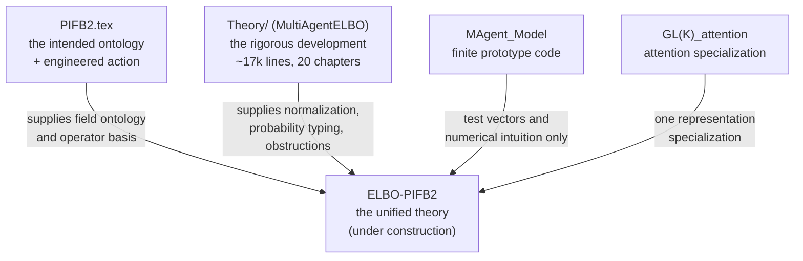
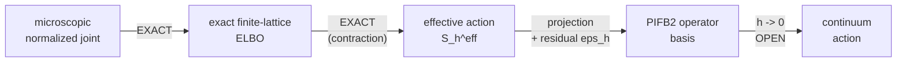

# Overview — the gauge-covariant multi-agent variational free energy programme

**Purpose.** One place to see what the theory *is*, which document owns which piece, and what is
proved versus open. Written 2026-08-12 because the material had scattered across four repositories
and three manuscripts.

**Read this first, then the worklog** (`docs/research-plans/2026-08-12-elbo-to-continuum-action-worklog.md`)
for the live derivation front.

---

## 1. The programme in one paragraph

Agents are **local sections of associated statistical bundles** over an abstract context manifold.
Each agent carries a belief and a generative model, both as probability laws, and compares them with
its neighbours through **gauge transports** rather than by naive identification. The claim under
construction is that the resulting multi-agent dynamics is variational — it descends a free energy —
and that this free energy is, sector by sector, either an **exact evidence bound** or an explicitly
labelled **effective term**. The long-range aspiration is that base geometry, and eventually
physics-like structure, is *derived from the information* rather than declared.

---

## 2. The objects

| Symbol | Type | Role |
|---|---|---|
| \(\mathcal C\) | smooth manifold | **context** space. Explicitly **not** space, not time, not the agent index set, not the interaction graph. "The domain of inquiry, not a thing." |
| \(P\to\mathcal C\) | principal \(G\)-bundle | frame bundle; \(G\le GL(K,\mathbb R)\), \(K\) = **fiber** dimension (so the simple rotation group is \(SO(K)\), not \(SO(N)\)) |
| \(\mathcal B_b,\mathcal B_m\) | statistical manifolds | belief and model law-fibers, with Fisher metric \(g^F\) |
| \(\mathcal E_b=P\times_{\hat\rho_b}\mathcal B_b\) | associated bundle | where beliefs live |
| \(q_i(c)\) | section of \(\mathcal E_b\) | **fast recognition density** over hidden states \(k_i\) |
| \(p_i(c)\) | section of \(\mathcal E_b\) | state prior |
| \(s_i(c)\) | section of \(\mathcal E_m\) | **slow generative-model section**, realized as a law over model parameters \(m_i\) |
| \(r_i(c)\) | section of \(\mathcal E_m\) | model hyperprior |
| \(L_i(do\mid k,m)\) | Markov kernel | likelihood. Predictive model \(\overline L_i(do\mid k)=\int L_i(do\mid k,m)\,s_i(dm)\) |
| \(\Omega_{ij},\widetilde\Omega_{ij}\) | fiber maps | transports of belief / model from \(j\)'s frame into \(i\)'s |
| \(\beta_{ij},\gamma_{ij}\) | simplex rows | attention weights, belief and model channels |
| \(A\) (or \(\omega\)) | principal connection | compares fibers at *different* base points |

**Two channels, everywhere.** Everything comes in a belief (state) copy and a model copy. Agents may
hold *different generative models*, and \(\gamma_{ij}D_{\rm KL}(s_i\|(\widetilde\Omega_{ij})_\#s_j)\)
is model-alignment, distinct from belief-alignment \(\beta_{ij}D_{\rm KL}(q_i\|(\Omega_{ij})_\#q_j)\).

**Standing conventions.** \(N\) (agent count) is **fixed and finite**. Continuum limits refine the
*base lattice only*; thermodynamic \(N\to\infty\) is a later theory. Start with compact \(G\); full
\(GL(K)\) is a later extension.

---

## 3. The documents and what each owns

| Artifact | What it is | How to treat it |
|---|---|---|
| **`PIFB2.tex`** | The vision. Bundle ontology, five-term action, transformer recovery, time-from-information, participatory reading. | The **intended ontology and candidate operator basis**. Its action is an *ansatz* — PIFB2 says so itself. |
| **`Theory/*.tex`** | The rigorous development: measure-theoretic hygiene, exact evidence identities, pullback geometry, exact agent-network RG, and a chapter of **obstructions**. | The **mathematical authority**. Where PIFB2 and Theory disagree, Theory is usually right and PIFB2 usually knows it. |
| **`MAgent_Model`** | Grid-shaped Gaussian/\(GL(K)\) implementation. | **Legacy prototype and oracle.** Not the specification. The replacement codebase is built from the theorems. |
| **`GL(K)_attention`** | Attention as a gauge specialization. | One representation choice, not the abstract layer. |

---

## 4. The two theories, and why you need both

|  | Exact-ELBO theory | PIFB2-type action theory |
|---|---|---|
| Primitive | fixed normalized generative law + recognition law | section configuration + action functional |
| Agent | coordinate/block in a joint measurable state | belief and model sections over a base domain |
| Strength | exact normalization, evidence bounds, posterior semantics | directly represents the intended interacting section-agents |
| Weakness | exact about *coordinate blocks*, not full section-agents | ad hoc terms, ill-typed integrals, no guaranteed continuum limit |

**Neither replaces the other.** The working resolution: the action is the organizing object; the
exact ELBO decides which sectors are probabilistically real, supplies normalization and entropy, and
provides a non-circular derivation test.

---

## 5. The layered hierarchy — the spine of the whole programme

Status of each arrow:

| Arrow | Status |
|---|---|
| microscopic joint → finite-lattice ELBO | **EXACT** — the closed theorem, §6 |
| finite-lattice ELBO → effective action | **EXACT** identity by KL disintegration |
| effective action → PIFB2 basis | **OPEN**. \(S_h^{\rm exact}=S_h^{\rm PIFB}+\varepsilon_h+c_h\) is currently a *tautology*; \(\varepsilon_h\) is defined as the difference |
| finite lattice → continuum | **OPEN**. Needs equicoercivity + \(\Gamma\)-convergence; the gauge sector is Millennium-adjacent |

---

## 6. What is actually proved

**The closed theorem** (`docs/derivations/2026-08-12-exact-two-channel-finite-elbo/`,
`COMPLETE_AFFIRMATIVE`). For finite agent-site set \(A\), conditional on history \(H_n\), a
**tied-replica** normalized joint — private pair \((K_a,M_a)\), a belief label-copy block with source
\(u^n_{ab}=(\Omega^n_{ab})_\#q^n_b\), a model label-copy block with
\(v^n_{ab}=(\widetilde\Omega^n_{ab})_\#s^n_b\) — has exact negative ELBO

$$
\mathcal F_h^{n+1}=\mathcal F_{\rm PIFB2,h}^{\rm lag,1}+\sum_a I_{\zeta_a}(K_a;M_a),
$$

so under the state–model mean field \(\zeta_a=q_a\otimes s_a\) the **lagged, unit-temperature,
unit-coefficient two-channel PIFB2 action is exactly a negative ELBO**.

Reading of the terms:
- Both transported KL channels are **exact finite-mixture KL components**, not guessed penalties.
- Row entropies \(D_{\rm KL}(\beta\|\pi)\) are exact **at \(\tau=1\)**.
- \(I_{\zeta}(K;M)\) is **mandatory** whenever state and model recognition are correlated; PIFB2
  currently omits it.
- It is exact on an **enlarged tied-replica inventory**, and it is **lagged** — the generative law
  reads \(q^n\), never the same-step \(q^{n+1}\).

**Other established results:** exact fast-state profiling identity; compact-subgroup reduction by
Haar averaging; exact finite-lattice KL contraction; gauge-covariant informational pullback geometry
with an exact defect cocycle (`Theory/05c`); exact agent-network RG (`Theory/07b`).

---

## 7. The obstructions — what the theory may *not* say

These are the programme's teeth. Every one is a proved negative.

| Name | Statement | Where |
|---|---|---|
| **State-level ELBO no-go** | On an open mean-field product family with fixed rows, live pairwise KL against other variational factors is **not** the negative ELBO of one fixed state-level joint | `PIFB2.tex:3280` |
| **A-NOGO (O1)** | For a \(G\)-torsor fiber, \(\mathrm{Aut}_G(P)\) acts simply transitively on sections, so **every** gauge-invariant functional of a section is constant | wave2-01 |
| **O2 / Thm A4.4** | If a section functional is *required* to equal the finite-design ELBO, its integrand must be **jet-free** — the connection is expelled | wave2-01:385, :488 |
| **Thm A4.5** | A genuine integral over \(\mathcal C\) can at best be a non-unique **extension** of a finite-design ELBO | wave2-01:406 |
| **B4 finite-design holonomy** | No observation-record statistic detects holonomy, curvature, or bundle topology **for any finite design** — because the connection is not an argument of any generative kernel. **Defeated for curve-mediated transport** (§8): its own defeat condition at wave2-01:709 is "change either and the theorem is unavailable", and putting the connection into the source law \((\mathrm P_\gamma)_\#q_j\) does exactly that | wave2-01:695 |
| **Coercivity lemma** | If a fiber gauge orbit is noncompact, **no** gauge-invariant function has compact sublevel sets. Invariance and coercivity are in tension | `rm-02` §3.3 |
| **Yang–Mills indefiniteness** | \(\kappa\|F_A\|^2\) cannot be both gauge-invariant and bounded below for \(GL(K,\mathbb R)\); all Ad-invariant forms on \(\mathfrak{gl}(K)\) are indefinite | `rm-04` §1.5 |
| **Categorical rigidity** | The Fisher–Rao isometry group of the simplex is \(S_{n+1}\), **finite** — no positive-dimensional \(G\) acts on a categorical fiber by isometries | `rm-04` §1.1a |
| **Apex closure** | The tower cannot self-close; the apex prior cannot be derived | `Theory/11:239` |

---

## 8. Live front (this session)

- **Gradient sector.** The Fisher metric *is* the Hessian of KL, so base-neighbour transported KL is
  already a discrete Dirichlet energy. Verified: \(\tfrac12g^Fh^2+\tfrac13T_{\rm skew}h^3\) (or
  \(\tfrac16\) in the other argument order), with the \(h^3\) term cancelling on a symmetric stencil
  — so the weight \(h^{d-2}\) is **forced**. Flat transport only; covariant case open.
- **Escape from O2.** The finite-lattice base-neighbour term is a **two-point functional of values**,
  not a jet functional, so A4.4 does not apply to it. It costs exactly one hypothesis —
  `hyp:gen-design-product` ("excludes residual cross-design dependence", tagged `HYPOTHESIS`). A4.4
  then correctly says the \(h\to0\) *limit* is not a finite-design ELBO, which is precisely what
  licenses the effective-action framing.
- **Idle-wheel result.** Without a base-derivative sector the action factorizes over \(c\) entirely
  and \(\mathcal C\)'s manifold structure is idle by `12_philosophy.tex:77`'s own criterion. So
  **\(\mathcal C\) earns its manifold structure iff the generative model admits cross-context
  dependence**, and \(\eta_q\) is the strength of that dependence, not a free regularizer.
- **Base geometry decision (taken).** Keep N1; derive base geometry from information via the
  section-induced volume \(\int\sqrt{\det(\sigma^*g^F)}\), with the Polyakov auxiliary-metric form as
  the candidate ELBO bridge. Under test.
- **Curve-mediated transport — WITNESS COMPUTED.** Coupling agents along a *curve* in \(\mathcal C\)
  via parallel transport puts the connection **inside a generative kernel**, defeating the hypothesis
  B4 names as load-bearing. The \(U(1)\) two-path witness now runs
  (`docs/verification/u1_two_path_holonomy_witness.py`, all four checks pass): distinct holonomies
  give record laws at gauge-orbit distance \(0.319>0\), the separating statistic is
  \(\mathrm{Aut}_G(P)\)-invariant to \(10^{-15}\) and equals the holonomy, the flat coboundary gives
  *exactly* zero dependence (reproducing B4 under PIFB2's declared transport), and the tied-replica
  ELBO identity survives \(\Omega\to\mathrm P_\gamma\) to \(5\times10^{-13}\).
  **Existence witness, not a theorem** — one bundle, one fiber, one statistic, abelian \(G\).

---

## 9. Open decisions

1. **Which curve** mediates inter-agent transport — declared set, geodesics of the induced metric, or
   a weighted sum (Wilson line)?
2. **\(\gamma\) recognition-side or generative-side?** Decides whether profiling the base cometric is
   an ELBO operation or empirical Bayes.
3. **Compact \(G\) vs full \(GL(K)\).** Compact is kinematically necessary for the curvature sector
   and for coercivity. \(GL(K)\)'s SPD sector may encode complexity — but that needs a transforming
   SPD metric, coercivity control, and a gauge-invariant definition of "complexity".
4. **Same-time vs lagged.** Lagged is exact; same-time is what the code does. Whether they agree in a
   \(dt\to0\) limit is open.

---

## 10. Claim discipline

Say this, and not more:

> PIFB2 is a gauge-motivated **effective action** for interacting section-valued agents. Selected
> sectors admit **exact ELBO realizations**. The complete live-peer action is **not** an ordinary
> fixed-joint state-level ELBO on the original variables. A normalizable configuration-space Gibbs
> lift is exact **at a different level**. The grid code is a finite discretization *candidate* until
> the continuum limit closes. The base is a **context** manifold unless a physical interpretation is
> separately derived.

Do **not** say: that the complete PIFB2/MAgent action has been derived from the exact ELBO; that
\(\mathcal C\) is space; that holonomy is observable (unless §8's curve construction closes); that
minimizers exist for noncompact \(G\).

---

## 11. Where everything lives

| Location | Holds |
|---|---|
| `Desktop/MultiAgentELBO` | `Theory/*.tex`, PIFB2 copy, ultradeep audit waves 1–2, roadmap + coordinator review, the 3 derivation runs |
| `Documents/ChatGPT/MultiAgentELBO` | same derivations, plus the six `rm-01`…`rm-06` referee reports and the program-decision run |
| `C:/tmp/MultiAgentELBO-elbo-action-019ff75d` (branch `codex/elbo-effective-action-derivation`) | 3 derivation runs, this overview, the live worklog |
| `Desktop/Research` | live `PIFB2.tex`, the Obsidian wiki, `magent_elbo_whitepaper` |

**Nothing holds all of it.** The referee reports `rm-01`…`rm-06` exist in only one copy, and the
continuum roadmap was authored where neither audit wave was on disk — which is why the referees found
"non-collision through non-contact" rather than genuine agreement. **Consolidation should precede
further theory expansion.**
