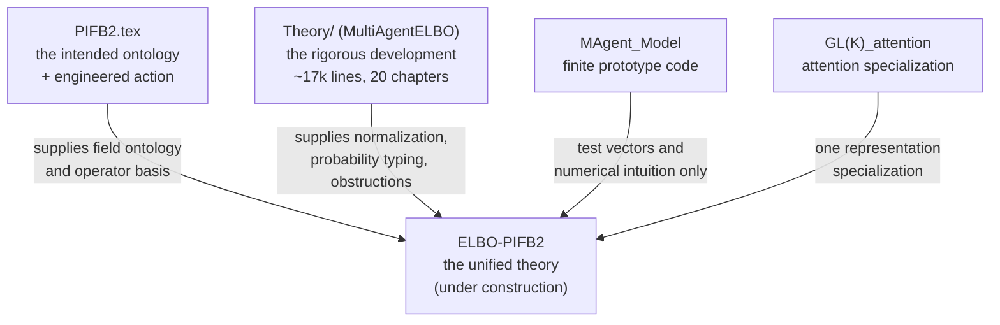
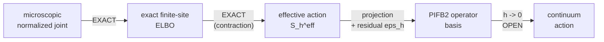

# Overview — the gauge-covariant multi-agent variational free energy program

**Purpose.** One place to see what the theory *is*, which document owns which piece, and what is
proved versus open. Written 2026-08-12 because the material had scattered across four repositories
and three manuscripts.

**Read this first, then the worklog** (`docs/research-plans/2026-08-12-elbo-to-continuum-action-worklog.md`)
for the live derivation front.

---

## 1. The program in one paragraph

At the ontological tier, an agent is an ordered pair \(z_i=(q_i,s_i)\) of local sections of two
associated bundles of normalized probability laws over a fixed, initially nonphysical context
manifold. The intended **agent-only ontology** means that agents are the only state-bearing relata;
the base, bundle, gauge action, interaction incidence, and variational rule are relational or
nomological scaffolding rather than a pre-given inventory of physical objects. Agents compare their
belief and model laws through **gauge transports**, while observations are endogenous records
generated by normalized interaction kernels. Apparent evolution is a history in the space of paired
sections, selected either by a VFE flow after a metric or mobility is declared, or by a separately
declared action principle. The long-range aspiration is that shared geometry, physical quantities,
and their unit structure emerge from the informational and relational structure of agents rather
than being inserted as physical primitives.

---

## 2. The objects

| Symbol | Type | Role |
|---|---|---|
| \(\mathcal C\) | smooth manifold | fixed, initially nonphysical **context** or noumenal index space. Explicitly **not yet** space, time, the agent index set, or the interaction graph. |
| \(P\to\mathcal C\) | principal \(G\)-bundle | frame bundle; \(G\le GL(K,\mathbb R)\), \(K\) = **fiber** dimension (so the simple rotation group is \(SO(K)\), not \(SO(N)\)) |
| \(\mathcal B_b,\mathcal B_m\) | normalized-law fibers | declared subsets of \(\mathcal P(\mathsf K)\) and \(\mathcal P(\mathsf M)\). Smooth statistical/Fisher geometry is an additional regular-tier hypothesis. |
| \(\mathcal E_b,\mathcal E_m\) | associated law bundles | \(P\times_{\widehat\rho_b}\mathcal B_b\) and \(P\times_{\widehat\rho_m}\mathcal B_m\), carrying belief and model laws |
| \(\mathcal E_A=\mathcal E_b\times_{\mathcal C}\mathcal E_m\) | paired agent bundle | the kinematic bundle for one agent's belief–model pair |
| \(z_i=(q_i,s_i)\) | section of \(\mathcal E_A|_{\mathcal C_i}\) | the primitive state-bearing content of agent \(i\) on its support \(\mathcal C_i\) |
| \(q_i(c)\) | section of \(\mathcal E_b\) | recognition/belief law over hidden state |
| \(s_i(c)\) | section of \(\mathcal E_m\) | generative-model law; not itself a generative transition kernel |
| \(p_i(c),r_i(c)\) | reference sections | state prior and model hyperprior; derived cross-scale where the hierarchy closes, otherwise declared boundary data |
| \(O_a\) | measurable record | an endogenous observation/event produced by interaction factor \(a\), not an additional substance or a posterior law |
| \(K_a(do_a\mid y_{\partial a},X)\) | normalized Markov kernel | fixed, recognition-independent generative law for the record of a scoped interaction |
| \(\Omega_{ij},\widetilde\Omega_{ij}\) | fiber maps | transports of belief / model from \(j\)'s frame into \(i\)'s |
| \(\beta_{ij},\gamma_{ij}\) | simplex rows | attention weights, belief and model channels |
| \(A\) (or \(\omega\)) | principal connection | compares fibers at *different* base points |

**Two channels, everywhere.** Everything comes in a belief (state) copy and a model copy. Agents may
hold *different generative models*, and \(\gamma_{ij}D_{\rm KL}(s_i\|(\widetilde\Omega_{ij})_\#s_j)\)
is model-alignment, distinct from belief-alignment \(\beta_{ij}D_{\rm KL}(q_i\|(\Omega_{ij})_\#q_j)\).

**Standing conventions.** \(N\) (agent count) is **fixed and finite**. Continuum limits refine the
*base lattice only*; thermodynamic \(N\to\infty\) is a later theory. Start with compact \(G\); full
\(GL(K)\) is a later extension.

### 2.1 Ontological target: paired law sections

The ambient theory is deliberately more general than its computational realizations. The fibers
\(\mathcal B_b\) and \(\mathcal B_m\) contain normalized laws on declared measurable spaces. A smooth
statistical manifold, differentiability in quadratic mean, a nondegenerate Fisher tensor, an
exponential family, and finally a multivariate Gaussian family are successive additional choices.
**Gaussians are a tractable coordinate backend, not the ontology.**

“Agent-only” therefore means **agents are the only state-bearing relata**. It does not mean that a
mathematical theory has no base, bundle, symmetry, incidence relation, probability kernel, or
variational rule. Those are presently admitted as relational or nomological structure. A stronger
closure in which some or all of that scaffolding is reconstructed from the interaction category of
the agents is an open target. Likewise, the exact observation–interaction equivalence supplies an
operational environment-node presentation, but does not by itself prove autonomy or agency for every
boundary node.

At the established finite tier, endogenous interaction records are generated once by one normalized
joint,

\[
P_\theta(dy,do\mid X)
=P_0(dy\mid X)\prod_{a\in\mathcal A}
K_a(X,y_{\partial a},do_a).
\]

The recognition law \(Q_o\) is a full, potentially correlated law on the latent product space. The
displayed marginal section pairs \((q_i,s_i)\) do not determine that dependence. Consequently, a
functional of paired sections is an exact VFE only after a declared lift into the joint recognition
family reproduces those sections; without such a lift it remains an **effective section action**.
The ultimate continuum target would place a proper probability law on a standard-Borel or Polish
space of admissible paired sections, but that section-space measure, its tightness, and its
finite-to-continuum derivation remain open.

An apparent history is a curve \(r\mapsto z(r)\) in a declared section/configuration space, ultimately
modulo gauge. The fixed base does not move along this curve. A VFE supplies an oriented
natural-gradient orbit only after a configuration metric or mobility is declared; Fisher length then
measures information duration along the selected orbit, not physical time. A stationary-action,
Hamiltonian, or quantum-phase account is a distinct branch requiring its own measure, kinetic or
symplectic structure, and boundary data. VFE descent and action extremization are not interchangeable.

### 2.2 Informational physicalization

On a regular smooth tier, each channel already induces a gauge-invariant, connection-relative
informational tensor on the base:

\[
h_{i,b}^{\omega_b}=(D^{\omega_b}q_i)^*g_b^F,
\qquad
h_{i,m}^{\omega_m}=(D^{\omega_m}s_i)^*g_m^F.
\]

These are positive-semidefinite semimetrics, with
\(\operatorname{rad}h_{i,x}^{\omega_x}=\ker D^{\omega_x}z_{i,x}\). They become nondegenerate metrics
only under an injectivity hypothesis or after a justified constant-rank quotient. They are invariant
under passive frame changes but depend on the selected connection. The common principal bundle does
not canonically combine the belief and model tensors or different agents' tensors. Channel weights,
cross terms, connection selection, and an inter-agent agreement or aggregation theorem are additional
obligations.

The physicalization program is therefore broader and more carefully typed than “everything is a
pullback.” Its general target is a natural, gauge-invariant, coarse-graining-compatible assignment

\[
\operatorname{Phys}_\alpha:
J_\omega^r(\mathfrak S)/\mathcal G
\longrightarrow
\Gamma\!\left(T^p_q\mathcal C\otimes L_\alpha\right),
\]

from relational section jets modulo gauge to candidate observable quantities. Fiber scalars may be
composed with sections and vertical covariant tensors may be pulled back through \(D^\omega\).
Connections, causal cones, representation labels, operators, action coefficients, and physical
constants require other typed constructions. A promising shared-geometry candidate is the Fisher
pullback of a collective **joint-law** section, because it retains dependence discarded by marginal
section pairs. This remains a hypothesis, not an established identification with physical geometry.

The present pullback results do **not** derive the topology, dimension, or differentiable structure
of \(\mathcal C\); Lorentzian signature; causal structure; physical time; field equations; or an
intersubjective choice of rods and clocks. They provide the first rigorous example of an informational
semigeometry from which such structures might later be constructed.

### 2.3 Units and physical constants

The working interpretation is that a physical dimension is a **type**, represented abstractly by a
one-dimensional dimension line \(L_\alpha\), while a unit is an agent- or community-relative choice
of nonzero basis in that line. Numerical values change when the basis changes; the typed quantity and
dimensionless predictions do not. On this reading, familiar unit names are perspectival calibrations
of quantities produced by a physicalization map, rather than additional ingredients of noumenal
reality. This is a programmatic hypothesis, but it gives unit changes the form of a scale gauge rather
than a division between mathematics and physics.

Information measured in nats or bits is dimensionless and log-base dependent. A pullback cannot by
itself manufacture a dimensionful quantity. An information-to-action proposal must therefore include
or derive a conversion morphism, for example

\[
S_{\rm phys}=\kappa_A I_{\rm nat},
\qquad [\kappa_A]=\text{action/nat}.
\]

Since one bit is \(\ln 2\) nats, declaring that one bit corresponds to \(\hbar\) would set
\(\kappa_A=\hbar/\ln 2\). That is a calibration condition, not a derivation of \(\hbar\), and neither
Bayesian updating nor the current action theory supplies a smallest nonzero update. The stronger open
goal is to derive a universal, log-base-invariant dimensionless relation such as
\(S_{\rm phys}/\hbar=f(I_{\rm nat})\), or to derive \(\kappa_A\) from quantization, topology, an RG
fixed point, symmetry breaking, or another independent consistency condition. Until then, the theory
should target gauge-, coordinate-, log-base-, and unit-invariant dimensionless predictions before
claiming an absolute physical constant.

---

## 3. The documents and what each owns

| Artifact | What it is | How to treat it |
|---|---|---|
| **`PIFB2.tex`** | The vision. Bundle ontology, five-term action, transformer recovery, time-from-information, participatory reading. | The **intended ontology and candidate operator basis**. Its action is an *ansatz* — PIFB2 says so itself. |
| **`Theory/*.tex`** | The rigorous development: measure-theoretic hygiene, exact evidence identities, pullback geometry, exact agent-network RG, and a chapter of **obstructions**. | The **mathematical authority**. Where PIFB2 and Theory disagree, Theory is usually right and PIFB2 usually knows it. |
| **`MAgent_Model`** | Grid-shaped Gaussian/\(GL(K)\) implementation. | **Legacy prototype and oracle.** Not the specification. The replacement codebase is built from the theorems. |
| **`GL(K)_attention`** | Attention as a gauge specialization. | One representation choice, not the abstract layer. |

---

## 4. The two theories, and why you need both

|  | Exact-ELBO theory | PIFB2-type action theory |
|---|---|---|
| Primitive | fixed normalized generative law + recognition law | section configuration + action functional |
| Agent | coordinate/block in a joint measurable state | belief and model sections over a base domain |
| Strength | exact normalization, evidence bounds, posterior semantics | directly represents the intended interacting section-agents |
| Weakness | exact about *coordinate blocks*, not full section-agents | ad hoc terms, ill-typed integrals, no guaranteed continuum limit |

**Neither replaces the other.** The working resolution: the action is the organizing object; the
exact ELBO decides which sectors are probabilistically real, supplies normalization and entropy, and
provides a non-circular derivation test.

---

## 5. The layered hierarchy — the spine of the whole program

Status of each arrow:

| Arrow | Status |
|---|---|
| microscopic joint → finite-site ELBO | **EXACT** — the closed theorem, §6 |
| finite-site ELBO → effective action | **PROVEN, CONDITIONAL** — exact given a normalized posterior, a recognition-independent measurable \(C_h\), a common pushforward path, and a declared **product** reference measure |
| tied-replica/PIFB2 instantiation | **OPEN** — three explicit \(C_h\) supplied (worklog §4.3) and \(\varepsilon_h,c_h\) now in closed form, but \(\varepsilon_h=0\) only at \(C_h=\mathrm{id}\), and the law is blockwise-product, so it cannot pose the effective-action question |
| effective action → PIFB2 basis | **OPEN**. \(S_h^{\rm exact}=S_h^{\rm PIFB}+\varepsilon_h+c_h\) is no longer a tautology (worklog §4.3 gives closed forms), but the residual is computed against a *stipulated* projection on a law with no cross-agent content |
| finite lattice → continuum | **OPEN**. Needs equicoercivity + \(\Gamma\)-convergence; the gauge sector is Millennium-adjacent |

---

## 6. What is actually proved

**The closed theorem** (`docs/derivations/2026-08-12-exact-two-channel-finite-elbo/`,
`COMPLETE_AFFIRMATIVE`). For finite agent-site set \(A\), conditional on history \(H_n\), a
**tied-replica** normalized joint — private pair \((K_a,M_a)\), a belief label-copy block with source
\(u^n_{ab}=(\Omega^n_{ab})_\#q^n_b\), a model label-copy block with
\(v^n_{ab}=(\widetilde\Omega^n_{ab})_\#s^n_b\) — has exact negative ELBO

$$
\mathcal F_h^{n+1}=\mathcal F_{\rm PIFB2,h}^{\rm lag,1}+\sum_a I_{\zeta_a}(K_a;M_a),
$$

so under the state–model mean field \(\zeta_a=q_a\otimes s_a\) the **lagged, unit-temperature,
unit-coefficient two-channel PIFB2 action is exactly a negative ELBO**.

Reading of the terms:
- Both transported KL channels are **exact finite-mixture KL components**, not guessed penalties.
- Row entropies \(D_{\rm KL}(\beta\|\pi)\) are exact **at \(\tau=1\)**.
- \(I_{\zeta}(K;M)\) is **mandatory** whenever state and model recognition are correlated; PIFB2
  currently omits it.
- It is exact on an **enlarged tied-replica inventory**, and it is **lagged** — the generative law
  reads \(q^n\), never the same-step \(q^{n+1}\).
- **The observation term is not matched to literal PIFB2.** The theorem's term is
  \(-\mathbb E_{\zeta_a}\log L_a(o_a\mid K_a,M_a)\), an expectation under the **joint** private law.
  PIFB2's boxed display (`Theory/PIFB2.tex:689`) writes \(\mathbb E_{q_i(c)}[\log p(o(c)\mid k_i,m_i)]\)
  with \(m_i\) **unbound and not among the functional's declared arguments** (`:684`); its pointwise
  display (`:669`) drops \(m_i\) entirely. **Equality to the literal PIFB2 observation term is not
  proved and is not currently well-posed.** The joint typing is the one the ELBO forces —
  \(D_{\rm KL}(\zeta\|p\otimes r)=D_{\rm KL}(q\|p)+D_{\rm KL}(s\|r)+I_\zeta(K;M)\), verified to
  \(1.1\times10^{-16}\). If `:669` is read as the predictive marginal
  \(-\mathbb E_q\log\int L(o\mid k,m)s(dm)\), the two differ by
  \(\mathbb E_q[D_{\rm KL}(s\|s^{(o,k)})]\ge0\), so the theorem's scalar is an **upper bound**, and the
  gap is **unbounded** in the model uncertainty (Gaussian instance:
  \(d^2v/(2(v+1))+(v-\log(1+v))/2\)). Registered internally since
  `docs/research-plans/2026-08-12-pifb2-continuum-roadmap.md:104` and `rm-03-action-class.md:363-365`.

**Other established results:** exact fast-state profiling identity; compact-subgroup reduction by
Haar averaging; exact finite-site KL contraction; gauge-covariant informational pullback geometry
with an exact defect cocycle (`Theory/05c`); exact agent-network RG (`Theory/07b`).

---

## 7. The obstructions — what the theory may *not* say

These are the program's teeth. Every one is a proved negative.

| Name | Statement | Where |
|---|---|---|
| **State-level ELBO no-go** | On an open mean-field product family with fixed rows, live pairwise KL against other variational factors is **not** the negative ELBO of one fixed state-level joint | `PIFB2.tex:3280` |
| **A-NOGO (O1)** | For a \(G\)-torsor fiber, \(\mathrm{Aut}_G(P)\) acts simply transitively on sections, so **every** gauge-invariant functional of a section is constant | wave2-01 |
| **O2 / Thm A4.4** | If a section functional is *required* to equal the finite-design ELBO, its integrand must be **jet-free** — the connection is expelled | wave2-01:385, :488 |
| **Thm A4.5** | A genuine integral over \(\mathcal C\) can at best be a non-unique **extension** of a finite-design ELBO | wave2-01:406 |
| **B4 finite-design holonomy** | No observation-record statistic detects holonomy, curvature, or bundle topology **for any finite design** — because the connection is not an argument of any generative kernel. **Its HOLONOMY clause is defeated for curve-mediated transport** (§8), for **flat monodromy only**: its own defeat condition at wave2-01:709 is "change either and the theorem is unavailable", and putting the connection into the source law \((\mathrm P_\gamma)_\#q_j\) does exactly that. **The curvature and bundle-topology clauses are untouched** — \(F=dA\equiv0\) on any 1-dimensional base and every principal \(U(1)\) bundle over \(S^1\) is trivial (\(H^2(S^1;\mathbb Z)=0\)), so the witness cannot test them. Testing those needs \(\mathcal C=T^2\) (curvature, nontrivial \(H^2\)) or \(S^2\) (Chern classes, matching B4's own F4 counterexample at wave2-01:674-680) | wave2-01:695 |
| **Coercivity lemma** | If a fiber gauge orbit is noncompact, **no** gauge-invariant function has compact sublevel sets. Invariance and coercivity are in tension | `rm-02` §3.3 |
| **Yang–Mills non-definiteness** | \(\mathfrak{gl}(K,\mathbb R)\) admits **no positive-definite** Ad-invariant inner product, hence no fixed-inner-product \(\kappa\|F_A\|^2\) that is both gauge-invariant and coercive. The Ad-invariant symmetric forms are exactly the 2-dim space \(\{a\,\mathrm{tr}(XY)+b\,\mathrm{tr}X\,\mathrm{tr}Y\}\); every form with \(a\ne0\) is indefinite (signature \((3,1)\) for \(K=2\), \((6,3)\) for \(K=3\)), but the line \(a=0,b>0\) gives \(b\,(\mathrm{tr}X)(\mathrm{tr}Y)\), which **is** Ad-invariant and nonnegative — degenerate, with radical \(\mathfrak{sl}(K,\mathbb R)\), vanishing identically on \(\mathfrak{sl}(K)\)-valued connections. So "every Ad-invariant form is indefinite" is **false**; the correct no-go is positive-definiteness. Compact type is necessary *and* sufficient for a **fixed** definite form, but is **not** required for invariance or nonnegativity as such — see worklog §4.2 | `rm-04` §1.5 (erratum: rm-04 overstates at :43-46, :295-299 and :879; only :285-288 and :984 are correctly scoped) |
| **Categorical rigidity** | The Fisher–Rao isometry group of the simplex is \(S_{n+1}\), **finite** — no positive-dimensional \(G\) acts on a categorical fiber by isometries | `rm-04` §1.1a |
| **Apex closure** | The tower cannot self-close; the apex prior cannot be derived | `Theory/11:239` |

---

## 8. Live front (this session)

- **Gradient sector.** The Fisher metric *is* the Hessian of KL, so base-neighbor transported KL is
  already a discrete Dirichlet energy. Verified: \(\tfrac12g^Fh^2+\tfrac13T_{\rm skew}h^3\) (or
  \(\tfrac16\) in the other argument order), with the \(h^3\) term cancelling on a symmetric stencil
  — so the weight \(h^{d-2}\) is forced **as the unique deterministic Riemann-sum weight**. Two
  caveats: the exact ELBO is a counting-measure sum with unit coefficients and supplies \(h^{d-2}\)
  only via the declared integer replication \(m_h=\lceil dh^{-2}\rceil\); and the forcing is by **edge
  counting alone**, not by the \(h^3\) cancellation, which improves the *rate* from \(O(h)\) to
  \(O(h^2)\) but is not needed for the limit to exist (`panelB-V-BRIDGE-derivation.md:63`).
  **The covariant case is now CLOSED** — see worklog §4.1(i).
- **Escape from O2.** The finite-site base-neighbor term is a **two-point functional of values**,
  not a jet functional, so A4.4 does not apply to it. It costs exactly one hypothesis —
  `hyp:gen-design-product` ("excludes residual cross-design dependence", tagged `HYPOTHESIS`). A4.4
  then correctly says the \(h\to0\) *limit* is not a finite-design ELBO, which is precisely what
  licenses the effective-action framing.
- **Idle-wheel result (NARROWED 2026-08-13).** Without a base-derivative sector the action
  factorizes over \(c\) entirely and \(\mathcal C\)'s manifold structure is idle by
  `12_philosophy.tex:77`'s own criterion. That half stands. So **\(\mathcal C\) earns its manifold
  structure iff the action contains a term coupling distinct contexts** — and such a term is
  available from an exact finite ELBO **with `hyp:gen-design-product` intact**, via a lagged,
  history-measurable transported label-copy channel. The earlier phrasing "iff the generative model
  admits cross-context dependence" is **withdrawn**: an explicit exact-ELBO instance on a strictly
  design-product law (total correlation \(7.4\times10^{-17}\)) carries a strictly positive
  base-neighbor sector, and conversely relaxing the hypothesis yields an interaction energy
  \(-\mathbb E\log\psi(k_a,k_b)\), not a transported KL — a different functional with a different
  value. What the sector actually costs is a transported label-copy block \((J_a,X_a)\) added to
  `Theory/04`'s declared generative class, plus the replication multiplicity \(m_h\). Correspondingly
  \(\eta_q\) is **fixed by the declared source row \(\beta\) and the declared \(m_h\)** — a declared
  coefficient, not a measure of dependence.
- **Base geometry program — CANDIDATE, NOT CLOSED.** Keep N1's aim of deriving physical geometry from
  information, but use the rigorous connection-relative tensor
  \(h_\sigma^\omega=(D^\omega\sigma)^*g^F\), not an ordinary section pullback. The volume
  \(\int\sqrt{\det h_\sigma^\omega}\) exists only after a nondegenerate-rank hypothesis or a justified
  quotient; otherwise rank drop makes the determinant vanish and permits crumpling. The induced-volume
  and Polyakov constructions are engineered, diffeomorphism-invariant action candidates. The worklog
  establishes a genuine ELBO variational bridge only in \(d=2\), not in general dimension. It remains
  open whose individual or collective joint-law section induces the candidate geometry and how
  agent-relative tensors become one shared physical structure.
- **Curve-mediated transport — WITNESS COMPUTED.** Coupling agents along a *curve* in \(\mathcal C\)
  via parallel transport puts the connection **inside a generative kernel**, defeating the hypothesis
  B4 names as load-bearing. The \(U(1)\) two-path witness now runs
  (`docs/verification/u1_two_path_holonomy_witness.py`, all four checks pass): distinct holonomies
  give record laws at gauge-orbit distance \(0.319>0\), the separating statistic is
  \(\mathrm{Aut}_G(P)\)-invariant to \(10^{-15}\) and **separates the holonomy up to \(\Theta\leftrightarrow-\Theta\)**
  (the implemented statistic is \(\arccos(\cos\Theta)\); the \(\Theta\) and \(2\pi-\Theta\) *record laws*
  are exactly gauge-equivalent under \(g^*=\pi/2+\Theta/2\) plus a label swap, so the equal-weight
  design cannot orient it), the flat coboundary gives
  *exactly* zero dependence (reproducing B4 under PIFB2's declared transport), and the tied-replica
  ELBO identity survives \(\Omega\to\mathrm P_\gamma\) to \(5\times10^{-13}\).
  **Existence witness, not a theorem** — one bundle, one fiber, one statistic, abelian \(G\).

---

## 9. Open decisions

1. **Agent-only closure.** Which background structures remain irreducible relational or nomological
   data, and which of \(\mathcal C,P,G,\omega\), incidence, and interaction kernels must be reconstructed
   from the agents themselves?
2. **Physicalization rule.** Which individual or collective joint-law section, connection, quotient,
   channel combination, and cross-agent aggregation define a shared candidate geometry? What supplies
   nondegeneracy, Lorentzian signature, causal cones, and operational rods and clocks?
3. **Units and constants.** Are physical predictions limited to relational, dimensionless invariants,
   or can the theory derive dimension lines and universal conversion morphisms such as an
   information-to-action scale? No identification with \(\hbar\) is presently derived.
4. **Variational branch.** Which phenomena use dissipative VFE flow, which use a stationary action,
   and what extra mobility, measure, kinetic, symplectic, phase, and boundary structures select each?
5. **Which curve** mediates inter-agent transport — declared set, geodesics of the induced metric, or
   a weighted sum (Wilson line)?
6. **\(\gamma\) recognition-side or generative-side?** Decides whether profiling the base cometric is
   an ELBO operation or empirical Bayes.
7. **Compact \(G\) vs full \(GL(K)\).** Compact is kinematically necessary for the curvature sector
   and for coercivity. \(GL(K)\)'s SPD sector may encode complexity — but that needs a transforming
   SPD metric, coercivity control, and a gauge-invariant definition of "complexity".
8. **Same-time vs lagged — ANSWERED (negatively), 2026-08-13.** Lagged is exact; same-time is what
   the code does. They do **not** agree in a \(dt\to0\) limit: worklog §4.5 proves the lagged scheme
   converges to \(\dot x=-V^{\rm rec}\), not to \(-\nabla S\), and \(V^{\rm rec}\) is generically not
   the gradient of any \(C^2\) potential (directed attention 3-cycle: complex eigenvalues for every
   \(b>0\), so no gradient flow). Scope: that counterexample is a *directed peer* cycle, whereas the
   base-neighbor stencil is edge-symmetric, where the two flows agree up to halved coupling.
   Remaining open: which to deploy.

---

## 10. Claim discipline

Say this, and not more:

> PIFB2 is a gauge-motivated **effective action** for interacting section-valued agents. Selected
> sectors admit **exact ELBO realizations**. The complete live-peer action is **not** an ordinary
> fixed-joint state-level ELBO on the original variables. A normalizable configuration-space Gibbs
> lift is exact **at a different level**. The grid code is a finite discretization *candidate* until
> the continuum limit closes. The base is a **context** manifold unless a physical interpretation is
> separately derived. At the intended ontological tier, agents are the only state-bearing relata and
> each agent's primitive kinematics is a pair of general normalized-law sections; Gaussian families
> are computational realizations. Connection-relative Fisher pullbacks supply gauge-invariant
> positive-semidefinite informational semigeometries. Their identification with shared physical
> geometry, units, constants, causal structure, or physical time requires additional bridge theorems.

Do **not** say: that the complete PIFB2/MAgent action has been derived from the exact ELBO; that
\(\mathcal C\) is space; that every physical property is literally a pullback; that a Fisher pullback
is automatically nondegenerate or Lorentzian; that VFE alone supplies an orbit, speed, or physical
time; that one bit has been derived to equal \(\hbar\); that holonomy is observable (unless §8's curve
construction closes); or that minimizers exist for noncompact \(G\).

---

## 11. Where everything lives

*Rebuilt 2026-08-13 from `git ls-files` at `4dee0db`; the previous table was stale.*

| Location | Holds |
|---|---|
| `Desktop/MultiAgentELBO` (**this repo, `main`**) | `Theory/*.tex`, PIFB2 copy, ultradeep audit waves 1–2, roadmap + coordinator review, the six `rm-01`…`rm-06` referee reports, the program-decision run, the 16 recovered panel returns (`docs/audits/panels-2026-08-12/`), this overview, the live worklog, both verification scripts, and the interim referee review |
| `Documents/ChatGPT/MultiAgentELBO` | a second checkout of the same history; owns several `.superpowers` worktrees |
| `Desktop/Research` | live `PIFB2.tex`, the Obsidian wiki, `magent_elbo_whitepaper` |

The `C:/tmp/MultiAgentELBO-elbo-action-019ff75d` worktree was **removed on 2026-08-13**. It was
registered to the `Documents/ChatGPT` checkout, held no unmerged commits (`HEAD = e1f8795`, already an
ancestor of `main`), and its four uncommitted files were strictly behind `main`. The branch ref
survives.

**The Desktop checkout now holds all of the derivation and audit material** — the earlier claim that
`rm-01`…`rm-06` "exist in only one copy" was falsified by commit `caa4a15` itself. What remains true
is the historical point: the continuum roadmap was authored where neither audit wave was on disk,
which is why the referees found "non-collision through non-contact" rather than genuine agreement.
**Consolidation of the two checkouts should still precede further theory expansion.**
