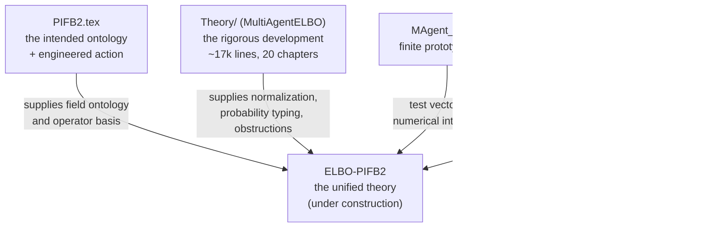
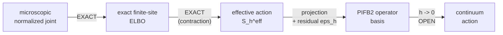

# Overview — the gauge-covariant multi-agent variational free energy program

**Purpose.** One place to see what the theory *is*, which document owns which piece, and what is
proved versus open. Written 2026-08-12 because the material had scattered across four repositories
and three manuscripts.

**Read this first, then the worklog** (`docs/research-plans/2026-08-12-elbo-to-continuum-action-worklog.md`)
for the live derivation front.

---

## 1. The program in one paragraph

At the ontological tier, an agent is an ordered pair \(z_i=(q_i,s_i)\) of local sections of two
associated bundles of normalized probability laws over a fixed, initially nonphysical context
manifold. The intended **agent-only ontology** means that agents are the only state-bearing relata;
the base, bundle, gauge action, interaction incidence, and variational rule are relational or
nomological scaffolding rather than a pre-given inventory of physical objects. Agents compare their
belief and model laws through **gauge transports**, while observations are endogenous records
generated by normalized interaction kernels. Apparent evolution is a history in the space of paired
sections, selected either by a VFE flow after a metric or mobility is declared, or by a separately
declared action principle. The long-range aspiration is that shared geometry, physical quantities,
and their unit structure emerge from the informational and relational structure of agents rather
than being inserted as physical primitives.

---

## 2. The objects

| Symbol | Type | Role |
|---|---|---|
| \(\mathcal C\) | smooth manifold | fixed, initially nonphysical **context** or noumenal index space. Explicitly **not yet** space, time, the agent index set, or the interaction graph. |
| \(P\to\mathcal C\) | principal \(G\)-bundle | frame bundle; \(G\le GL(K,\mathbb R)\), \(K\) = **fiber** dimension (so the simple rotation group is \(SO(K)\), not \(SO(N)\)) |
| \(\mathcal B_b,\mathcal B_m\) | normalized-law fibers | declared subsets of \(\mathcal P(\mathsf K)\) and \(\mathcal P(\mathsf M)\). Smooth statistical/Fisher geometry is an additional regular-tier hypothesis. |
| \(\mathcal E_b,\mathcal E_m\) | associated law bundles | \(P\times_{\widehat\rho_b}\mathcal B_b\) and \(P\times_{\widehat\rho_m}\mathcal B_m\), carrying belief and model laws. The action **must** be by pushforward, \(\widehat\rho_x(g)=(\rho_x(g))_\#\) for bimeasurable parameter-independent \(\rho_x:G\to\operatorname{Aut}(\mathsf K)\) (`Theory/02` `eq:geo-pushforward-actions`); this is what makes \(g^F\) invariant and it is what every invariance claim in §2.2 consumes. A merely smooth \(G\le GL(K,\mathbb R)\) action on \(\mathcal B\subseteq\mathcal P(\mathsf K)\) need not be Fisher-isometric — projective tilting on the simplex drifts \(g^F\) by tens of percent. |
| \(\mathcal E_A=\mathcal E_b\times_{\mathcal C}\mathcal E_m\) | paired agent bundle | the kinematic bundle for one agent's belief–model pair |
| \(z_i=(q_i,s_i)\) | section of \(\mathcal E_A|_{\mathcal C_i}\) | the primitive state-bearing content of agent \(i\) on its support \(\mathcal C_i\) |
| \(q_i(c)\) | section of \(\mathcal E_b\) | recognition/belief law over hidden state |
| \(s_i(c)\) | section of \(\mathcal E_m\) | generative-model law; not itself a generative transition kernel |
| \(p_i(c),r_i(c)\) | reference sections | state prior and model hyperprior; derived cross-scale where the hierarchy closes, otherwise declared boundary data |
| \(O_a\) | measurable record | an endogenous observation/event produced by interaction factor \(a\), not an additional substance or a posterior law |
| \(K_a(do_a\mid y_{\partial a},X)\) | normalized Markov kernel | fixed, recognition-independent generative law for the record of a scoped interaction |
| \(\Omega_{ij},\widetilde\Omega_{ij}\) | fiber maps | transports of belief / model from \(j\)'s frame into \(i\)'s |
| \(\beta_{ij},\gamma_{ij}\) | simplex rows | attention weights, belief and model channels |
| \(A\) (or \(\omega\)) | principal connection | compares fibers at *different* base points |

**Two channels, everywhere.** Everything comes in a belief (state) copy and a model copy. Agents may
hold *different generative models*, and \(\gamma_{ij}D_{\rm KL}(s_i\|(\widetilde\Omega_{ij})_\#s_j)\)
is model-alignment, distinct from belief-alignment \(\beta_{ij}D_{\rm KL}(q_i\|(\Omega_{ij})_\#q_j)\).

**Standing conventions.** \(N\) (agent count) is **fixed and finite**. Continuum limits refine the
*base lattice only*; thermodynamic \(N\to\infty\) is a later theory. Start with compact \(G\); full
\(GL(K)\) is a later extension.

### 2.1 Ontological target: paired law sections

The ambient theory is deliberately more general than its computational realizations. The fibers
\(\mathcal B_b\) and \(\mathcal B_m\) contain normalized laws on declared measurable spaces. A smooth
statistical manifold, differentiability in quadratic mean, a nondegenerate Fisher tensor, an
exponential family, and finally a multivariate Gaussian family are successive additional choices.
**Gaussians are a tractable coordinate backend, not the ontology.**

“Agent-only” therefore means **agents are the only state-bearing relata**. It does not mean that a
mathematical theory has no base, bundle, symmetry, incidence relation, probability kernel, or
variational rule. Those are presently admitted as relational or nomological structure. A stronger
closure in which some or all of that scaffolding is reconstructed from the interaction category of
the agents is an open target. Likewise, the exact observation–interaction equivalence supplies an operational environment-node
presentation, but does not by itself prove autonomy or agency for every boundary node. Randomization
and subsequent marginalization can give distinct presentations of the same scoped retained record law.
The certified finite presentation-descent theorem gives the exact retained boundary: collapsed
retained-variable VFE and, for strictly positive \(C^2\) retained families that agree parameterwise,
the retained Fisher tensor and every common \(C^1\) pullback descend. Arbitrary uncompleted
full-latent VFE and full-joint Fisher tensors do not factor through those retained data, and node
inventories do not descend under the certified observational equivalence.

The operational-intervention boundary is now exact in several declared categories, always relative
to fixed protocol data, target/type coloring where retained, ordered external roles, and admitted
morphisms. For any fixed monoid \(A\) and response \(\Phi\), write
\(\pi:A\twoheadrightarrow\operatorname{Syn}(\Phi)\). Every response-compatible
\(q:A\twoheadrightarrow B\) with \(\Phi=\psi q\) admits one unique surjective unital homomorphism
\(h:B\twoheadrightarrow\operatorname{Syn}(\Phi)\) satisfying
\(\pi=hq\) and \(\bar\Phi h=\psi\). When \(A\) is finite this
minimizes protocol-class cardinality only. Under compact-metrizable monoid and continuous-response
hypotheses, a countable dense contextual signature realizes a compact metrizable quotient with
continuous multiplication and response. Neither result selects a raw DAG or latent realization.

Raw finite normalized typed DAG presentations still form
\(\mathsf{FinTIP}_{R,O}^{\mathrm{iso}}\), all partial hard assignments form a total
right-override monoid, and reduction gives
\(\operatorname{Red}:\mathsf{FinTIP}\to\mathsf{FinRIE}\) and
\(\overline U_{\mathrm{pass}}:\mathsf{FinRIE}\to\mathsf{FinObs}\). The chains with equal passive retained law
\(L(1/4,1/3)\) and \(L(1/3,1/4)\) have nonisomorphic fifteen-class hard experiments, so no
universal \(R\overline U_{\mathrm{pass}}\cong\operatorname{id}\) recovers every reduced
experiment there; \(\overline U_{\mathrm{pass}}R\cong\operatorname{id}\) may still choose a
representative. Independent null-node collapse is a control.

The same BSC pair remains nonidentifiable for normalized marked-soft mediator replacements: its
exact face diameters are \((1-2\epsilon)/3\) and \((1-2\epsilon)/2\), with strict-interior
witnesses. It also remains nonidentifiable after independent affine randomization, where a nonzero
fifteen-coordinate contextual determinant forces randomized equivalence to be equality and every
admitted affine convolution isomorphism restricts to the forbidden hard isomorphism. This second
proof is needed because convexification destroys the old unmatched-response invariant.

On a finite DAG, declared normalized standard-Borel kernel families with jointly measurable
evaluations give a Borel retained response. The construction supplies an algebraic quotient but does
not by itself establish a standard-Borel quotient; that requires an exhibited smooth classifier or
stronger topology. Compact-Polish state spaces, compact palettes, isolated baseline symbols,
and jointly Feller kernels give a compact metrizable quotient with weakly continuous response. On
the circle, the ordered heat chains \(H_sH_t\) and \(H_tH_s\) have the same passive retained law,
yet \(H_s\) strictly Blackwell-dominates \(H_t\) and their soft response sets are strictly
nested. Where declared, the marked-soft and circle comparisons retain the mediator target. Every
BSC and circle comparison retains \(R\) as input/parameter, \(O\) as output/observation, and one global response
map; only the circle comparison retains heat geometry. Target erasure, boundary exchange, and time
reversal are not admitted in those frozen categories.

On the tier \(Q_R\ll P_R(\cdot\mid o)\), posterior completion, or minimization over auxiliary
lifts at fixed \(Q_R\), removes the expected conditional-KL defect. None of these operational
invariants canonically agentizes an environment node. Correlated or adaptive interventions and
identification of null-version point interventions from almost-sure passive observational
conditionals remain open, as do noncompact quotients, raw minimal realization, category canonicity,
autonomous agency, base-manifold continuum/gauge/RG dynamics, fixed-observation VFE recovery, and
the physical bridge.

The finite selector boundary is sharper. Under fixed-arity coordinatewise finite Markov kernels
whose channel randomness is independently tensored, preparation maps uniquely force the product
section. This is not a claim about all kernels in \(\mathsf{FinStoch}\). A wide
marginal-compatible enlargement containing that local class admits a natural section exactly when
every added morphism preserves product laws, so the product-preserving kernels form the maximal such
category. The frozen contract separately declares both split refinements \(R_{1/3}\) and
\(R_{1/2}\). From one fair source, each has fair/fair target marginals, but their joint atom
multisets are respectively
\(\{1/3,1/3,1/6,1/6\}\) and
\(\{3/8,3/8,1/8,1/8\}\). Naturality under both declared splits would require one single-valued
selector to return both unequal laws, even after relabeling. The admission of both splits and
single-valuedness are load-bearing. Thus the absolute selector with those quantifiers is
**REFUTED**, not merely open.

Under the declared full naturality and canonicity requirements, selecting nonproduct dependence
requires either restricting the admitted morphism class or adding declared relational, constraint,
or reference data. For a declared finite reference \(p\), statistic \(T\), and target moment \(m\), a
finite-KL minimizer of \(D(q\Vert p)\) subject to \(\mathbb E_qT=m\) exists exactly when
\(m\in\operatorname{conv}T(\operatorname{supp}p)\) and is then unique as a law. For a deterministic
coarse map \(f:X\to Y\), conditional-KL completion is defined for \(r\ll f_\#p\) and composes
strictly along nested maps when every stage uses the pushed reference. These are relative
selectors, not marginal-only or agency-producing constructions.

The retained Fisher quotient is likewise conditional. For retained-law map \(\rho\) and
positive-semidefinite target tensor \(g\),
\(\operatorname{rad}(\rho^*g)=d\rho^{-1}(\operatorname{rad}g)\); it equals
\(\ker d\rho\) only under the stated transversality. Constant rank then gives a positive-definite
quotient vector bundle, while a global quotient manifold still needs a simple Hausdorff leaf space.
Under that transversality equality and a regular connected-leaf quotient, the specific pullback
\(\rho^*g\) is basic because \(\rho\) factors through that quotient. Basicness is not automatic for
arbitrary tensors, declared block projectors, or the connection-relative covariant jet in
Theory/05c.

"State-bearing" needs an operational criterion or the thesis is unfalsifiable, since any candidate
counterexample can be reclassified as scaffolding. Take the checkable one: an object is state-bearing
if the declared record-law map \(\theta\mapsto P_\theta(dy,do\mid X)\) is non-constant in it. Under
that criterion the declared connection coordinate is state-bearing in §8's constrained curve-mediated
presentation: the exact observable \(S(\Theta)=\|\mathbb E O\|^2\) changes from \(1\) to \(0.5\) at
fixed agent sections. The zero-connection explicit-twist control shows that the same record law has
another presentation and therefore does not identify a connection origin. PIFB2's Regime II instead
promotes \(A^{(i)}_\mu\) to an independent action-bearing dynamical field with its own curvature term
and coercivity problem (`Theory/PIFB2.tex:142`); no normalized connection-dependent record kernel has
yet been supplied there, so the record-law criterion is not established for that regime. The exact finite
result is therefore an **operationally agent-only presentation** in the Regime-I,
frame-derived-connection tier. The certified retained objects descend under the finite observational
quotient; canonical agentization and reclassification of \(\omega\) elsewhere remain open obligations
of §9 item 1, not a settled ontology.

At the established finite tier, endogenous interaction records are generated once by one normalized
joint,

\[
P_\theta(dy,do\mid X)
=P_0(dy\mid X)\prod_{a\in\mathcal A}
K_a(X,y_{\partial a},do_a).
\]

The recognition law \(Q_o\) is a full, potentially correlated law on the latent product space. The
displayed marginal section pairs \((q_i,s_i)\) do not determine that dependence. Consequently, a
functional of paired sections is an exact VFE only after a declared lift into the joint recognition
family reproduces those sections; without such a lift it remains an **effective section action**.
For each fixed tuple of marginals, the unrestricted Fréchet class contains the product coupling
(`05_elbo.tex:37`). That pointwise existence fact does **not** construct an admissible right-inverse
lift into the selected joint family, much less prove its measurability, smoothness, or equivariance.
Such a lift remains declared data. Couplings can be unique when the marginals are degenerate and are
generally nonunique otherwise. When the full target factorizes and its energy is additive in the
marginal variables, `05_elbo.tex` `eq:elbo-total-correlation-signs` gives the exact VFE as the marginal
section functional plus \(\mathrm{TC}(Q)\), so the product coupling minimizes over that Fréchet class.
For a coupled likelihood or non-product reference, the expected energy also varies with the coupling;
the marginals alone imply neither a product extremum nor a one-sided bound. The finite categorical
certificate makes this noncanonicity explicit: for binary marginals \((a,b)\), both \(\iota_0\) and
\(\iota_{1/2}\), with \(d_\kappa=\kappa a(1-a)b(1-b)\), are smooth positive right inverses of
marginalization. At \(a=b=1/2\) they give \((8,8,8,8)/32\) and \((9,7,7,9)/32\); against a uniform
posterior their full-joint VFEs differ, and their Fisher pullbacks are \(\operatorname{diag}(4,4)\)
and \(\frac1{63}\begin{pmatrix}256&-32\\-32&256\end{pmatrix}\). Thus even smooth positive lifts
with the same paired marginals are not canonical. Note that the closed
theorem of §6 makes a stronger declaration:
its recognition law is \(\bigotimes_a Q_a\) with \(\zeta_a=q_a\otimes s_a\), so its total correlation
vanishes identically across agents and across channels. That is the theorem's declared family, not
this section's ontological target.

**Governing correction, 2026-08-14 -- one finite collective lift now exists.** For three paired
binary agents, write the six bits as \(x\), take
\(p_0(x;\theta)=\prod_i\theta_i^{x_i}(1-\theta_i)^{1-x_i}\),
\(D(\theta)=\prod_i\theta_i(1-\theta_i)\), and
\(\chi(x)=(-1)^{\sum_i x_i}\). For fixed \(|\kappa|<1\),
\(p_\kappa=p_0+\kappa\chi D\) is strictly positive and normalized; every proper marginal is the
corresponding product marginal. It is therefore a smooth marginal right inverse and immersion. For
each fixed marginal tuple, however, it explores only one parity line in the 57-dimensional Frechet
fiber. This supersedes any reading of the preceding historical paragraph as saying that no concrete
correlated right inverse exists. It does not supply arbitrary-family or coarse-preserving existence,
and it cannot be the absolute canonical selector refuted above; it is a nonproduct lift relative to
the declared parity interaction data.

The lift is exactly equivariant under simultaneous complement of both channels of an agent and under
typed agent permutations. An odd single-channel complement sends \(\kappa\) to \(-\kappa\), so
independent odd relabelings require a pseudoscalar interaction coordinate. The construction uses no
within-pair belief--model swap and yields no \(GL(K)\) action, Lie connection, intervention identity,
or autonomous agency. If \(\kappa\) is promoted to a parameter, the full-joint map has rank seven
everywhere, while singleton retention has rank six with kernel exactly
\(\operatorname{span}\{\partial_\kappa\}\). Thus \(\kappa\) is an identifiable full-joint
interaction direction that singleton retention erases. This rank statement does not type or
agentize \(\kappa\); typing and any autonomous-agency interpretation remain declared input or open.

The exact general score identity is
\(G_J-G_w=K-C+\sum_i(1-w_i)G_i\), with \(K=\mathbb E[RR^T]\) and signed
\(C=\sum_{i\ne j}\mathbb E[L_iL_j^T]\). In this parity family all pairs are independent, so
\(C=0\) and \(K\succ0\) for \(\kappa\ne0\). At \(\theta_i=1/2\), put
\(c=\kappa/64\): then \(G_J=4I_6/(1-c^2)\), the unit-marginal residual is
\(4c^2I_6/(1-c^2)\), and \(\kappa=1/2\) gives \(4I_6/16383\). Full-tangent equality with weighted
marginals requires every \(w_i=1/(1-c^2)\); unit weights agree only when \(\kappa=0\). This
positive ordering is family-specific: the older two-bit lift has an indefinite joint-minus-product
Fisher difference.

At the symmetric point the supplied record
\(K_{\rm hyp}(1\mid x)=\tfrac12(1+c\chi(x))\), with uniform prior, has evidence \(1/2\) and posterior
exactly \(p_\kappa\). Its posterior VFE is the tight value \(\log2\); the product lift has excess
\(-\tfrac12\log(1-c^2)\). This is a declared three-agent hyperedge kernel, not a derivation from
pairwise locality, conditional independence, or canonical agency. Fixed-outside updates of any one
two-channel agent block obey both the exact local--global VFE difference identity and its
differential. Absolute canonical lift selection under the declared two-split contract is refuted,
while the reference-relative selectors above retain their stated conditions. Arbitrary-family lift
existence, coarse-graining preservation, continuum extension, physical geometry, physical time,
units, and renormalization remain open.
The ultimate continuum target would place a proper probability law on a standard-Borel or Polish
space of admissible paired sections, but that section-space measure, its tightness, and its
finite-to-continuum derivation remain open.

An apparent history is a curve \(r\mapsto z(r)\) in a declared section/configuration space, ultimately
modulo gauge. The fixed base does not move along this curve. A VFE supplies an oriented
natural-gradient orbit only after a configuration metric or mobility is declared; Fisher length then
measures information duration along the selected orbit, not physical time. A stationary-action,
Hamiltonian, or quantum-phase account is a distinct branch requiring its own measure, kinetic or
symplectic structure, and boundary data. VFE descent and action extremization are not interchangeable.

### 2.2 Informational physicalization

On the regular tier of `Theory/05c` `hyp:pb-regular-models` — differentiability in quadratic mean,
square-integrable scores, and a **positive-definite** fiber Fisher form, which is §2.1's *third*
successive choice and not its first — each channel induces a passively frame-covariant,
connection-relative informational tensor on the base:

\[
h_{i,b}^{\omega_b}=(D^{\omega_b}q_i)^*g_b^F,
\qquad
h_{i,m}^{\omega_m}=(D^{\omega_m}s_i)^*g_m^F.
\]

These are positive-semidefinite semimetrics — degenerate metric tensors in the stipulated sense of
`05c` `def:pb-informational-pullbacks`, not "semimetric" in the drop-the-triangle-inequality sense —
with \(\operatorname{rad}h_{i,x}^{\omega_x}=\ker D^{\omega_x}z_{i,x}\) **per channel**, writing
\(z_{i,b}:=q_i\) and \(z_{i,m}:=s_i\). For the *pair* the correct statement is `05c`
`prop:pb-product-radical`,
\(\operatorname{rad}h^{\rm prod}=\ker D^{\omega_b}q_i\cap\ker D^{\omega_m}s_i\), which additionally
consumes declared positive channel weights. The inclusion \(\supseteq\) is free; the reverse consumes
positive-definiteness of \(g^F\) and fails on an overparameterized fiber (for
\(\{N(\theta_1+\theta_2,1)\}\), \(D^\omega s\ne0\) yet \(h=0\)).

They become nondegenerate metrics only under an injectivity hypothesis or after a justified
constant-rank quotient, and both routes are narrower than they sound. A dimension-count heuristic
suggests that a generic section can be everywhere nondegenerate only when
\(\dim\mathcal B\ge 2d\), with a candidate rank-drop stratum of dimension
\(2d-\dim\mathcal B-1\) otherwise. This is not yet a theorem here: it requires an appropriate jet-
transversality statement, regularity hypotheses, and control of global topology. The constant-rank
route yields a metric on a quotient **vector bundle**; a metric on a quotient **base** needs
involutivity and basicness besides, and then lives on \(\bar{\mathcal U}\), not on \(\mathcal C\).

They are invariant under **passive** frame changes. They are *not* fixed by the active gauge group at
a fixed connection — `05c:146-154` carries the counterexample transporting \(h=0\) to \(dx^2\) — and
they depend on the selected connection. A local, pointwise candidate calculation for the declared
Gaussian fiber under \(G\le GL(K,\mathbb R)\), restricted to the regular orbit stratum \(r>0\),
suggests that the Fisher-orthogonal quotient projection of the pointwise tensor is
\(d(r^2)_x\otimes d(r^2)_x/(4r^2+2r^4)\), with
\(r^2=\mu^\top\Sigma^{-1}\mu\), hence rank \(\le1\). The formula is undefined at \(r=0\) and no
continuation or minimization claim is made there. The quantifiers are at most: for each section and
base point, choose a connection value adapted to that section. This calculation has not established a
single smooth global connection, compatibility of the pointwise choices, or a connection that works
for every section. It is therefore a warning about connection dependence, not a global degeneracy
theorem.

The common principal bundle supplies no cross tensor between the **marginals**. A declared product
joint on the paired bundle \(\mathcal E_A\) has Fisher metric exactly
\(g_b^F\oplus g_m^F\), giving the natural unweighted direct sum for that declaration. A differentiable
correlated joint family can instead carry Fisher cross blocks, but those bilinear tensor components
depend on the declared joint family and its lift. They are not the scalar mutual information
\(I_\zeta(K;M)\). Neither cross blocks nor mutual information are determined by the marginals alone.
Connection selection and an inter-agent agreement or aggregation theorem remain additional
obligations.

The physicalization program is therefore broader and more carefully typed than “everything is a
pullback.” Its general target is a natural, \(\mathcal G\)-equivariant assignment, coarse-graining
compatible **under `05c` `eq:pb-isotropy-criterion`** (without that criterion the fine and coarse
tensors differ by a sign-indefinite term, and even with it coarse-graining creates new null
directions and does not preserve rank),

\[
\operatorname{Phys}_\alpha:
J^1\!\left(\mathfrak S\times_{\mathcal C}\mathcal A\right)\!/\mathcal G
\longrightarrow
\Gamma\!\left(T^p_q\mathcal C\otimes L_\alpha\right),
\]

from relational section jets modulo gauge to candidate observable quantities. Two typing points are
load-bearing. The connection space \(\mathcal A\) must sit **inside** the quotient: \(\mathcal G\)
moves \(\omega\), so it does not act on a jet space with \(\omega\) frozen, and \(h^\omega_\sigma\) is
not a function on such a quotient. And the order is \(r=1\): a principal connection canonically splits
the *first* jet bundle and no higher one, so \(r\ge2\) would additionally consume a linear connection
on \(T\mathcal C\) — which `02_geometry.tex:22-24` and `appendix_claim_ledger.tex:270` both say is
never selected — plus a choice of \(\alpha\) on the vertical bundle. The quotient is in general a
**stratified set**, not a manifold: the isotropy algebra jumps (\(\mathfrak{so}(K-1)\) at
\(\mu\ne0\), \(\mathfrak{so}(K)\) at \(\mu=0\)), and it jumps along a single section, so
\(\operatorname{Phys}_\alpha\) is smooth at best on the principal stratum. \(L_\alpha\) must be
declared as a flat oriented real line bundle with \(L_\alpha\otimes L_\beta\cong L_{\alpha+\beta}\)
and \(L_0=\mathbb R_{\mathcal C}\); a global unit requires triviality, and a non-flat scale connection
would make unit comparison path-dependent.

Fiber scalars may be composed with sections and vertical covariant tensors may be pulled back through
\(D^\omega\). Connections, causal cones, representation labels, operators, action coefficients, and
physical constants require other typed constructions. A promising shared-geometry candidate is the
Fisher pullback of a collective **joint-law** section, because it retains dependence discarded by
marginal section pairs — the Schur term of `Theory/08` `prop:ig-pullback-vs-pushforward`, and, when
the dependence itself varies along the base, a sector on which the marginal-pair pullback vanishes
identically. The *retention* is established; it is a block-congruence invariant requiring
`08_infogeometry:433`'s agentwise-block reframing hypothesis, and it is **not** a Loewner
enrichment (the difference is indefinite). What remains a hypothesis is the identification with
physical geometry.

The present pullback results do **not** derive the topology, dimension, or differentiable structure
of \(\mathcal C\); Lorentzian signature; causal structure; physical time; field equations; or an
intersubjective choice of rods and clocks. Building on the associated-bundle formulation of agents in
Dennis (2025) and the informal proposal of Sengupta et al. (2016), they give a rigorous account of the
**connection-split** informational geometry that a section of an associated bundle with
statistical-manifold fibers induces on its base, with an exact defect cocycle. The Fisher metric and
Amari–Chentsov tensor are pullbacks by definition (Ay–Jost–Lê–Schwachhöfer 2017); the increment here
is the connection-split vertical jet, not pullback geometry as such.

### 2.3 Units and physical constants

We adopt the standard typed treatment of physical quantity: a physical dimension is a **type**,
represented by a one-dimensional dimension line \(L_\alpha\), and a unit is a choice of nonzero basis
in that line, so numerical values change with the basis while the typed quantity does not. This is not
new here — it is Whitney (1968), developed in Hart (1995) and in Janyška–Modugno–Vitolo (2010), whose
"scaled spaces" are exactly the \(T^p_q\mathcal C\otimes L_\alpha\) of §2.2 — and reading unit change
as a **scale gauge** is Weyl's original *Eichinvarianz* (1918). The program's own increment is only
that the basis choice is **agent- or community-relative**: familiar unit names become perspectival
calibrations of quantities produced by a physicalization map rather than additional ingredients of
noumenal reality. That increment is the programmatic hypothesis; the typed formalism itself is
standard.

Information carries its own dimension line \(L_I\), whose bases are the log bases (nat, bit, ban); it
is a dimensionless *number* only once a base is fixed, and calling it "dimensionless" while its value
changes with that choice contradicts the reading just given. Note also that §2.2 has already spent
this freedom: \(g^F\) is canonically normalized only in nats, the base at which
\(g^F=-\partial\partial'\mathrm{KL}\) and \(g^F=\mathbb E[\ell\ell]\) coincide (their ratio is
\(\ln b\)), so \(h^\omega\) is a nats-normalized tensor and the log-base gauge is available to
information scalars only. A pullback cannot by itself manufacture a dimensionful quantity. An
information-to-action proposal must therefore include or derive a conversion morphism, for example

\[
S_{\rm phys}=\kappa_A I_{\rm nat},
\qquad [\kappa_A]=\text{action/nat}.
\]

Since one bit is \(\ln 2\) nats, declaring that one bit corresponds to \(\hbar\) would set
\(\kappa_A=\hbar/\ln 2\). That is a calibration condition, not a derivation of \(\hbar\) — and on the
dimension-line reading it cannot be otherwise: \(\kappa_A\) is the component of a fixed linear
morphism \(L_I\to L_{\rm action}\) in a chosen basis, a linear map between one-dimensional lines has
exactly one basis-independent datum, and a calibration is precisely what fixes it. **No calibration
of a linear conversion is ever a derivation.**

Nor is a smallest nonzero update available to supply a scale. That is a no-go, not a gap: on any DQM
tier \(\mathrm{KL}(q_\theta\|q_{\theta+h})=\tfrac12g^Fh^2+O(h^3)\), so \(\inf\{\mathrm{KL}(q\|q'):q\ne q'\}=0\);
and on the finite-record tier any positive floor is defeated by garbling the record through a channel
close enough to the constant one, since the update KL cannot increase under post-processing. Only a
recognition family discretized by fiat has a positive minimum, and that minimum is family-dependent,
hence useless for fixing \(\kappa_A\).

The stronger open goal must therefore be stated against a declared nonzero reference scale,
\(S_{\rm phys}/\hbar=f(I/I_0)\). A bare numerical \(f(I)\) is convention-dependent unless the
information unit is fixed; using \(I_{\rm nat}\) fixes that log-base convention, while the ratio
\(I/I_0\) is invariant when numerator and reference are expressed in the same information unit. The
reference \(I_0\) need not be a smallest nonzero update: it may be calibrated externally or selected
by additional structure. The no-go above rules out obtaining it as a minimum KL
update on the stated smooth and garblable tiers; it does not rule out every possible reference scale.
Deriving \(\kappa_A\) or \(\hbar\), however, still requires a canonical nonzero element of
\(L_{\rm action}\), equivalently a scale-setting mechanism; conditions invariant under change of basis
in \(L_{\rm action}\) fix it only up to \(\mathbb R_{>0}\). Of the routes usually named — quantization, topology, an RG fixed point, symmetry
breaking — topological and RG conditions return integers and dimensionless exponents, and
"quantization" imports \(\hbar\) rather than deriving it. Until such a mechanism is exhibited, the
theory should target gauge-, coordinate-, log-base-, and unit-invariant dimensionless predictions
before claiming an absolute physical constant.

---

## 3. The documents and what each owns

| Artifact | What it is | How to treat it |
|---|---|---|
| **`PIFB2.tex`** | The vision. Bundle ontology, five-term action, transformer recovery, time-from-information, participatory reading. | The **intended ontology and candidate operator basis**. Its action is an *ansatz* — PIFB2 says so itself. |
| **`Theory/*.tex`** | The rigorous development: measure-theoretic hygiene, exact evidence identities, pullback geometry, exact agent-network RG, and a chapter of **obstructions**. | The **mathematical authority**. Where PIFB2 and Theory disagree, Theory is usually right and PIFB2 usually knows it. |
| **`MAgent_Model`** | Grid-shaped Gaussian/\(GL(K)\) implementation. | **Legacy prototype and oracle.** Not the specification. The replacement codebase is built from the theorems. |
| **`GL(K)_attention`** | Attention as a gauge specialization. | One representation choice, not the abstract layer. |

---

## 4. The two theories, and why you need both

|  | Exact-ELBO theory | PIFB2-type action theory |
|---|---|---|
| Primitive | fixed normalized generative law + recognition law | section configuration + action functional |
| Agent | coordinate/block in a joint measurable state | belief and model sections over a base domain |
| Strength | exact normalization, evidence bounds, posterior semantics | directly represents the intended interacting section-agents |
| Weakness | exact about *coordinate blocks*, not full section-agents | ad hoc terms, ill-typed integrals, no guaranteed continuum limit |

**Neither replaces the other.** The working resolution: the action is the organizing object; the
exact ELBO decides which sectors are probabilistically real, supplies normalization and entropy, and
provides a non-circular derivation test.

---

## 5. The layered hierarchy — the spine of the whole program

Status of each arrow:

| Arrow | Status |
|---|---|
| microscopic joint → finite-site ELBO | **EXACT** — the closed theorem, §6 |
| finite-site ELBO → effective action | **PROVEN, CONDITIONAL** — exact given a normalized posterior, a recognition-independent measurable \(C_h\), a common pushforward path, and a declared **product** reference measure |
| tied-replica/PIFB2 instantiation | **OPEN** — three explicit \(C_h\) supplied (`panelA-T-RESID-derivation.md:122-190`; worklog §4.3 carries two of them) and \(\varepsilon_h,c_h\) now in closed form, but \(\varepsilon_h=0\) only at \(C_h=\mathrm{id}\), and the law is blockwise-product, so it cannot pose the effective-action question |
| effective action → PIFB2 basis | **OPEN**. \(S_h^{\rm exact}=S_h^{\rm PIFB}+\varepsilon_h+c_h\) is no longer a tautology (worklog §4.3 gives closed forms), but the residual is computed against a *stipulated* projection on a law with no cross-agent content |
| finite lattice → continuum | **OPEN**. Needs equicoercivity + \(\Gamma\)-convergence for manifold-valued graph Dirichlet energies carrying a gauge connection — `rm-06-prior-art.md:277` prices this as *"real new work — T8 is the most expensive item in the roadmap"*, with García Trillos–Slepčev (scalar / \(\mathbb R^n\)-valued only) as the nearest prior art. Expensive analysis, not a Clay problem |

---

## 6. What is actually proved

**The closed theorem** (`docs/derivations/2026-08-12-exact-two-channel-finite-elbo/`,
`COMPLETE_AFFIRMATIVE`). For finite agent-site set \(A\), conditional on history \(H_n\), a
**tied-replica** normalized joint — private pair \((K_a,M_a)\), a belief label-copy block with source
\(u^n_{ab}=(\Omega^n_{ab})_\#q^n_b\), a model label-copy block with
\(v^n_{ab}=(\widetilde\Omega^n_{ab})_\#s^n_b\) — has exact negative ELBO

$$
\mathcal F_h^{n+1}=\mathcal F_{\rm joint\text{-}typed,h}^{\rm lag,1}
 +\sum_a I_{\zeta_a}(K_a;M_a),
$$

where \(\mathcal F_{\rm joint\text{-}typed,h}^{\rm lag,1}\) denotes the theorem's lagged,
unit-temperature, unit-coefficient two-channel scalar with a joint-typed observation term. Under the
state–model mean field \(\zeta_a=q_a\otimes s_a\), that declared scalar is exactly a negative ELBO. It
reproduces the two transported channels and row-entropy structure associated with PIFB2, but it is not
the literal PIFB2 functional because the latter's observation term is not presently well-typed.

Reading of the terms:
- Both transported KL channels are **exact finite-mixture KL components**, not guessed penalties.
- Row entropies \(D_{\rm KL}(\beta\|\pi)\) are exact **at \(\tau=1\)**.
- \(I_{\zeta}(K;M)\) is **mandatory** whenever state and model recognition are correlated; PIFB2
  currently omits it. Off the mean field the resulting scalar is not merely short one term: it is the
  substituted free energy of `Theory/05_elbo.tex` `prop:elbo-total-correlation-signs`
  (`\status{ESTABLISHED}`), a **pseudo-ELBO that is not an evidence bound at all** and can fall below
  \(-\log p(o\mid H_n)\) — by \(\log 2\) nats on this programme's own diagonal instance
  (`boundary-counterexamples.md:3-14`). Exactness is confined to the product family, where the
  violation is identically zero.
- It is exact on an **enlarged tied-replica inventory**, and it is **lagged** — the generative law
  reads \(q^n\), never the same-step \(q^{n+1}\).
- **The observation term is not matched to literal PIFB2.** The theorem's term is
  \(-\mathbb E_{\zeta_a}\log L_a(o_a\mid K_a,M_a)\), an expectation under the **joint** private law.
  PIFB2's boxed display (`Theory/PIFB2.tex:689`) writes \(\mathbb E_{q_i(c)}[\log p(o(c)\mid k_i,m_i)]\)
  with \(m_i\) **unbound and not among the functional's declared arguments** (`:684`); its pointwise
  display (`:669`) drops \(m_i\) entirely. **Equality to the literal PIFB2 observation term is not
  proved and is not currently well-posed.** The joint typing is the one the ELBO forces —
  \(D_{\rm KL}(\zeta\|p\otimes r)=D_{\rm KL}(q\|p)+D_{\rm KL}(s\|r)+I_\zeta(K;M)\), verified over
  \(2\times10^5\) random instances at **median** residual \(1.1\times10^{-16}\) (one ulp) and
  **maximum** \(2.7\times10^{-15}\) — the quoted \(1.1\times10^{-16}\) is a typical value, not a
  bound, and reaches \(5.7\times10^{-14}\) on concentrated laws. If `:669` is read as the predictive marginal
  \(-\mathbb E_q\log\int L(o\mid k,m)s(dm)\), then for
  \(\zeta(dk,dm)=q(dk)t_k(dm)\) the joint-minus-predictive difference is
  \(\mathbb E_q[D_{\rm KL}(t_k\|s^{(o,k)})-D_{\rm KL}(t_k\|s)]\), which is sign-indefinite.
  Under state-model mean field \(t_k=s\), it reduces to
  \(\mathbb E_q[D_{\rm KL}(s\|s^{(o,k)})]\ge0\), so only on that restriction is the theorem's scalar
  an **upper bound**, with a gap **unbounded** in model uncertainty (Gaussian instance:
  \(d^2v/(2(v+1))+(v-\log(1+v))/2\)). Registered internally since
  `docs/research-plans/2026-08-12-pifb2-continuum-roadmap.md:104` and `rm-03-action-class.md:364-366`.

**Other established results:** exact fast-state profiling identity; compact-subgroup reduction by
Haar averaging; exact finite-site KL contraction (**conditional** — under §5's four hypotheses, not
unconditionally); gauge-covariant informational pullback geometry with an exact defect cocycle
(`Theory/05c`); exact agent-network RG (`Theory/07b`) — where "exact" governs the *equations*
(`thm:rg-fixed-point-equations`), not the existence of a fixed point: every fixed sector exhibited
there is trivial (identity channel, one-point coarse space, or constant likelihood, which forces the
interaction coordinate to vanish), and the chapter's only computed exponent lives in an \(O(d)\)-reduced
sector that a general \(GL(d)\) action destroys (`07b:992-997`).

The measure-theoretic backbone for all of the above is `Theory/05_elbo.tex` — in particular
`thm:elbo-total-correlation-chain` and `prop:elbo-total-correlation-signs`, which supply the
Fréchet-class structure, the lift-to-value identity \(\widetilde{\mathcal F}=\mathcal F-\mathrm{TC}\),
and the pseudo-ELBO warning. Cite it: two independent reviewers have now mistaken those settled
results for gaps because §2.1 and §6 never pointed at them.

---

## 7. The obstructions — what the theory may *not* say

These are the program's teeth. Each row is a negative result, but they are not uniform: **two are
partially refuted by later work in this same document** (B4's holonomy clause, §8; the Yang–Mills
indefiniteness wording), and one (Apex closure) is a standard fact about finite DAGs recorded for
architecture rather than as a contribution.

**Provenance.** `wave2-*`, `rm-0*` and `panel*` are this program's **own multi-agent audit returns**,
not external peer review, and they are not integrated into `Theory/`. Panel B returns carry no
adversarial pass at all (the skeptic tier was lost). Results stated only in those files are
unrefereed. Where a row's authority is such a file, treat "proved" as "proved in an internal audit
return and not yet reproduced in `Theory/`."

| Name | Statement | Where |
|---|---|---|
| **State-level ELBO no-go** | On an open mean-field product family with fixed rows, live pairwise KL against other variational factors is **not** the negative ELBO of one fixed state-level joint | `PIFB2.tex:3281` (`thm:state_level_elbo_nogo`) |
| **A-NOGO (O1)** | For a \(G\)-torsor fiber, \(\mathrm{Aut}_G(P)\) acts simply transitively on sections, so **every** gauge-invariant functional of a section is constant. Torsor is *sufficient, not necessary*: \(G\)-homogeneity already suffices, so the conclusion also bites on the Gaussian fiber (\(\mathcal B\cong\mathrm{Aff}(K)/O(K)\), homogeneous but not a torsor). For the declared \(G\le GL(K,\mathbb R)\) the operative form is wave2-01 **Cor A3.5**: \(\mathcal B_b/G\cong[0,\infty)\) via \(r=(\mu^\top\Sigma^{-1}\mu)^{1/2}\), so the invariant content of *one* belief section is a single scalar per point. The escape is \(N\ge2\) relative invariants (`rm-04` §2.2) — which §2.2 currently declines when it defers inter-agent aggregation | wave2-01, Cor A3.5 at `:280-294` |
| **O2 / Thm A4.4** | If a section functional is *required* to equal the finite-design ELBO, its integrand must be **jet-free** — the connection is expelled | wave2-01:385, :488 |
| **Thm A4.5** | A genuine integral over \(\mathcal C\) can at best be a non-unique **extension** of a finite-design ELBO | wave2-01:406 |
| **B4 finite-design holonomy** | No observation-record statistic detects holonomy, curvature, or bundle topology **for any finite design** when the connection is not an argument of any generative kernel. Its HOLONOMY clause is made *unavailable* for the constrained curve-mediated presentation (§8), for **flat monodromy only**, because that presentation puts \((\mathrm P_\gamma)_\#q_j\) into the source law. Within that presentation the exact observable \(S(\Theta)=\|\mathbb E O\|^2=(1+\cos\Theta)/2\) separates \(0\) from \(\pi/2\) by \(0.5\); exact periodic, mirror, and coboundary gauges delimit its equivalence classes. Sampled total variation is only a diagnostic, not a lower-bound proof. An executable zero-connection presentation with explicit label-dependent twists reproduces the same mixture components exactly, so the records identify a relative group twist but do not identify its connection origin. Thus B4 is unavailable under the constrained presentation, not globally defeated. A multi-point cocycle-consistency test is a proposed next experiment; neither a three-point necessity nor sufficiency result is proved. **The curvature and bundle-topology clauses are untouched** — \(F=dA\equiv0\) on any 1-dimensional base and every principal \(U(1)\) bundle over \(S^1\) is trivial (\(H^2(S^1;\mathbb Z)=0\)), so the witness cannot test them. Testing those needs \(\mathcal C=T^2\) (curvature, nontrivial \(H^2\)) or \(S^2\) (Chern classes, matching B4's own F4 counterexample at wave2-01:674-680) | wave2-01:695 |
| **Coercivity lemma** | If a fiber gauge orbit is noncompact, **no** gauge-invariant function has compact sublevel sets. Invariance and coercivity are in tension | `rm-02` §3.3 |
| **Yang–Mills non-definiteness** | \(\mathfrak{gl}(K,\mathbb R)\) admits **no positive-definite** Ad-invariant inner product, hence no fixed-inner-product \(\kappa\|F_A\|^2\) that is both gauge-invariant and coercive. The Ad-invariant symmetric forms are exactly the 2-dim space \(\{a\,\mathrm{tr}(XY)+b\,\mathrm{tr}X\,\mathrm{tr}Y\}\); every form with \(a\ne0\) is indefinite — with signature \((3,1)\) for \(K=2\) and \((6,3)\) for \(K=3\) **only on the region \(a>0\) and \(a+bK>0\)**; the trace direction contributes \(K(a+bK)c^2\) and flips sign across \(a+bK=0\), giving \((2,2)\) or \((1,3)\) off that region, and the Killing form \((a,b)=(2K,-2)\) sits exactly on the degenerate locus with signature \((2,1,1)\) at \(K=2\) and \((5,3,1)\) at \(K=3\), so it has no \((p,n)\) signature at all. The line \(a=0,b>0\) gives \(b\,(\mathrm{tr}X)(\mathrm{tr}Y)\), which **is** Ad-invariant and nonnegative — degenerate, with radical \(\mathfrak{sl}(K,\mathbb R)\), vanishing identically on \(\mathfrak{sl}(K)\)-valued connections. So "every Ad-invariant form is indefinite" is **false**; the correct no-go is positive-definiteness. Compact type is necessary *and* sufficient for a **fixed** definite form, but is **not** required for invariance or nonnegativity as such — see worklog §4.2. **Scope:** this is a statement about the *unreduced* \(\mathfrak{gl}(K,\mathbb R)\). A belief section is exactly a reduction of the structure group to the isotropy \(O(K-1)\) (on the stratum \(r>0\)), which *is* compact and does carry \(-\operatorname{tr}(XY)\). The catch, and why this is no free rescue: \(\omega\) restricts to the reduced subbundle iff \(D^\omega s=0\), i.e. iff \(h^\omega_s\equiv0\). So a coercive fixed-inner-product curvature sector and a nonzero base semimetric are **mutually exclusive by construction**, and \(h^\omega_s\) is properly the Fisher-normed intrinsic torsion of that reduction rather than an information metric | `rm-04` §1.5 (erratum: rm-04 overstates at :43-46, :295-299 and :879; only :285-288 and :984 are correctly scoped) |
| **Categorical rigidity** | The Fisher–Rao isometry group of the simplex is \(S_{n+1}\), **finite** — no positive-dimensional \(G\) acts on a categorical fiber by isometries. Consequence (stronger, and the operative half): a **connected** \(G\) therefore acts *trivially* there, so \(\mathcal E_b=\mathcal C\times\mathcal B_b\) is canonically trivial, \(F_A\equiv0\) for every base dimension, and \(D^\omega q=dq\) for **every** connection. On a categorical belief channel §2.2's "connection-relative" tensor is connection-**in**dependent and reduces to the ordinary pullback | `rm-04` §1.1a, consequence at `rm-04:244-250` |
| **Apex closure** | The tower cannot self-close; the apex prior cannot be derived | `Theory/11:239` |

---

## 8. Live front (this session)

- **Gradient sector.** The Fisher metric is the **negative mixed second jet** of KL at the diagonal
  (`Theory/05c` `prop:pb-kl-divergence-jets`) — not "the Hessian", which names three different objects
  of two different signs — so base-neighbor transported KL is a discrete Dirichlet energy **to second
  order**, with a per-bond \(O(h^3)\) remainder. Verified:
  \(\tfrac12g^Fh^2+\tfrac16T_{\rm AC}h^3\) **in the fiber's natural chart, with the transported
  neighbour in slot 2** — which is what the declared coupling contract
  \(\beta_{ij}D_{\rm KL}(q_i\|(\Omega_{ij})_\#q_j)\) requires. (Perturbing slot 1 instead gives
  \(\tfrac13\); the earlier display led with that one, which is *not* the deployed orientation.
  `worklog:831` already carries \(\tfrac16\).) Neither cubic coefficient is a tensor: across natural,
  mean and sqrt charts the slot-1 \(h^3\) coefficient takes the values \(\{+\tfrac13,-\tfrac16,+\tfrac1{12}\}\),
  while \(\tfrac12\) is chart-invariant and only the **difference** of the two argument orders,
  \(\tfrac16T_{\rm AC}\), is invariant (`Theory/05c:583-587`). The \(h^3\) term cancels on a symmetric
  stencil, and the weight \(h^{d-2}\) is forced **as the unique deterministic Riemann-sum weight**.
  Three caveats: the exact ELBO is a counting-measure sum with unit coefficients and supplies
  \(h^{d-2}\) only via the declared integer replication \(m_h=\lceil dh^{-2}\rceil\); the forcing is by
  **edge counting alone**, not by the \(h^3\) cancellation, which improves the *rate* from \(O(h)\) to
  \(O(h^2)\) but is not needed for the limit to exist (`panelB-V-BRIDGE-derivation.md:63`); and the
  Dirichlet reading holds only at a self-consistent stationary configuration \(q^{n+1}=q^n\) —
  postulate (P2), an unproven \(\lim_{h\to0}\lim_{n\to\infty}\) exchange. **Absent (P2) the exact
  lagged ELBO delivers a positive-definite Fisher *mass* term plus a section-dependent constant, not a
  Dirichlet functional of the free field** (`panelA-T-GRAD-derivation.md` §5.8, whose own verdict line
  reads "the gradient sector is NOT genuinely ELBO-derived").
  **The covariant case is now CLOSED** — see worklog §4.1(i).
- **Escape from O2.** The finite-site base-neighbor term is a **two-point functional of values**,
  not a jet functional, so A4.4 does not apply to it. What it costs is **not** a relaxation of
  `hyp:gen-design-product` (that hypothesis stays intact — see the idle-wheel bullet below and its
  witness) but the addition of an \(H_n\)-measurable transported label-copy channel \((J_a,X_a)\) to
  `Theory/04`'s declared generative class, plus the replication multiplicity \(m_h\). A4.4 then
  correctly says the \(h\to0\) *limit* is not a finite-design ELBO, which is precisely what licenses
  the effective-action framing.
- **Idle-wheel result (NARROWED 2026-08-13).** Without a base-derivative sector the action
  factorizes over \(c\) entirely and \(\mathcal C\)'s manifold structure is idle by
  `12_philosophy.tex:77`'s own criterion. That half stands. So **\(\mathcal C\) earns its manifold
  structure iff the action contains a term coupling distinct contexts** — and such a term is
  available from an exact finite ELBO **with `hyp:gen-design-product` intact**, via a lagged,
  history-measurable transported label-copy channel. The earlier phrasing "iff the generative model
  admits cross-context dependence" is **withdrawn**: an explicit exact-ELBO instance on a strictly
  design-product law (total correlation \(7.4\times10^{-17}\)) carries a strictly positive
  base-neighbor sector, and conversely relaxing the hypothesis yields an interaction energy
  \(-\mathbb E\log\psi(k_a,k_b)\), not a transported KL — a different functional with a different
  value. What the sector actually costs is a transported label-copy block \((J_a,X_a)\) added to
  `Theory/04`'s declared generative class, plus the replication multiplicity \(m_h\). Correspondingly
  \(\eta_q\) is **fixed by the declared source row \(\beta\) and the declared \(m_h\)** — a declared
  coefficient, not a measure of dependence.
- **Base geometry program — CANDIDATE, NOT CLOSED.** Keep N1's aim of deriving physical geometry from
  information, but use the rigorous connection-relative tensor
  \(h_\sigma^\omega=(D^\omega\sigma)^*g^F\), not an ordinary section pullback. Pointwise,
  \(\sqrt{\det h_\sigma^\omega}\) is defined continuously through rank drop on the closed psd cone;
  rank drop makes this density vanish rather than become undefined. An extended volume functional
  still requires enough regularity for the induced density to be measurable and integrable, and the
  integral may be extended-valued unless finiteness is imposed. Variational use further requires
  domain and compactness or
  coercivity hypotheses. Even after those domain conditions, three obstructions remain. (i) The
  infimum is \(0\) and **is attained**, on
  the whole \(\operatorname{rank}<d\) cone, which contains sequences of unbounded Dirichlet energy — so
  the pathology is a degenerate minimizing *set*, not a failure of attainment. (ii) \(S_{\rm vol}\) is
  exactly \(\operatorname{Diff}(\mathcal C,\partial\mathcal C)\)-invariant, and diffeomorphism orbits
  are noncompact in every Sobolev norm, so no sublevel set is bounded; the only coercivity repair
  reintroduces the exogenous base cometric and density that \(S_{\rm vol}\) was introduced to avoid.
  (iii) A pointwise candidate calculation for the Gaussian fiber gives a connection-optimized floor
  of rank \(\le1\) in \(d\ge2\), but it does not construct one smooth global connection or establish
  the quantifier \(\exists\omega\,\forall\sigma\). It therefore exposes a serious connection-dependence
  obligation without proving that every section can be globally collapsed by one connection. The
  induced-volume and Polyakov constructions are engineered, diffeomorphism-invariant action candidates; note that at
  \(d\ge3\) the Polyakov objective is **unbounded below** along the conformal mode
  (\(f(\Omega)=\tfrac12[d\,\Omega^{d-2}-(d-2)\Omega^d]\to-\infty\), so \(\inf_\gamma S_P=-\infty\)),
  making it a stationarity constraint rather than a minimization problem and admitting no
  variational-inference reading at all; at \(d=2\), \(f\equiv1\) and the constraint degenerates into
  Weyl invariance. The worklog establishes a genuine ELBO variational bridge only in \(d=2\), and that
  selection is a homogeneity/Weyl fact about \(h\) as an abstract psd tensor, not an Amari–Chentsov
  fact. It remains open whose individual or collective joint-law section induces the candidate
  geometry and how agent-relative tensors become one shared physical structure.
- **Curve-mediated transport — WITNESS COMPUTED.** Coupling agents along a *curve* in \(\mathcal C\)
  via parallel transport puts the connection **inside a generative kernel**, violating the hypothesis
  B4 names as load-bearing, so B4's finite-design holonomy clause is unavailable for this constrained
  presentation. The \(U(1)\) two-path witness now runs
  (`docs/verification/u1_two_path_holonomy_witness.py`, all four checks pass). Its load-bearing
  separator is the exact observable \(S(\Theta)=\|\mathbb E O\|^2=(1+\cos\Theta)/2\), which gives
  \(S(0)-S(\pi/2)=0.5\). This requires neither the latent path label nor a sampled density estimate.
  Sampled total variation remains a diagnostic only: a finite gauge grid cannot establish a lower
  bound on the orbit infimum. The tied-replica ELBO identity survives
  \(\Omega\to\mathrm P_\gamma\) to \(1.3\times10^{-15}\).

  Exact component comparisons establish the periodic, mirror-plus-label-swap, and coboundary gauge
  equivalences. In particular, the mirror equivalence shows that the equal-weight design does not
  orient \(\Theta\). The executable CHECK 3 also constructs a zero-connection model with explicit
  label-dependent kernel twists and reproduces every curve-presentation mixture component exactly.
  Component-wise identity implies identical record laws; the data therefore identify a relative group
  twist within the constrained presentation, not its connection origin across broader generative
  presentations. This is a monodromy-sensitive **existence witness, not a theorem** — one bundle, one
  fiber, one observable, abelian \(G\). A multi-point cocycle-consistency test is a proposed next
  experiment, but no claim that three or more base points are necessary or sufficient is established.

  The design freezes the source law \(q_j\) as exogenous, which is what keeps
  \((\mathrm P_\gamma)_\#q_j\) from violating the recognition-independence typing of §2's \(K_a\) row.

---

## 9. Open decisions

1. **Agent-only closure after finite presentation descent.** Collapsed retained-variable VFE and
   strictly positive \(C^2\) parameterwise retained Fisher tensors descend; arbitrary uncompleted
   full-latent VFE, full-joint Fisher tensors, and node inventories do not. Relative to fixed
   operational data, the contextual protocol quotient is terminal and, for finite protocol monoids,
   has minimum class cardinality over the raw quotient map. This is not raw-realization minimality.
   In the frozen BSC category, equal passive retained law determines neither the reduced hard experiment, the
   normalized marked-soft mediator face, nor the independently randomized affine experiment. The
   compact-Feller circle pair supplies the corresponding smooth continuous no-go under preserved
   heat geometry and ordered boundary roles. On a finite DAG, declared normalized standard-Borel
   kernel families with jointly measurable evaluations give a Borel retained response. Measurability
   alone does not establish a standard-Borel quotient; that requires an exhibited smooth classifier or
   stronger topology.
   The null-node control collapses operationally; the absolute marginal selector under the declared
   two-split contract is separately refuted; and reference-relative selectors require added data.
   What protocol category, target typing, raw realization category, complexity rule, or
   equivalence-enriched criterion, if any, canonically agentizes operational environment nodes?
   Which of \(\mathcal C,P,G,\omega\), incidence, and interaction kernels must be reconstructed
   from the agents themselves?
2. **Physicalization rule.** Which individual or collective joint-law section, connection, quotient,
   channel combination, and cross-agent aggregation define a shared candidate geometry? What supplies
   nondegeneracy, Lorentzian signature, causal cones, and operational rods and clocks?
3. **Units and constants.** Are physical predictions limited to relational, dimensionless invariants,
   or can the theory derive dimension lines and universal conversion morphisms such as an
   information-to-action scale? No identification with \(\hbar\) is presently derived.
4. **Variational branch.** Which phenomena use dissipative VFE flow, which use a stationary action,
   and what extra mobility, measure, kinetic, symplectic, phase, and boundary structures select each?
5. **Which curve** mediates inter-agent transport — declared set, geodesics of the induced metric, or
   a weighted sum (Wilson line)?
6. **\(\gamma\) recognition-side or generative-side?** Decides whether profiling the base cometric is
   an ELBO operation or empirical Bayes.
7. **Compact \(G\) vs full \(GL(K)\).** Compact is kinematically necessary for the curvature sector
   and for coercivity. \(GL(K)\)'s SPD sector may encode complexity — but that needs a transforming
   SPD metric, coercivity control, and a gauge-invariant definition of "complexity".
8. **Same-time vs lagged — ANSWERED (negatively), 2026-08-13.** Lagged is exact; same-time is what
   the code does. They do **not** agree in a \(dt\to0\) limit: worklog §4.5 proves the lagged scheme
   converges to \(\dot x=-V^{\rm rec}\), not to \(-\nabla S\), and \(V^{\rm rec}\) is generically not
   the gradient of any \(C^2\) potential (directed attention 3-cycle: complex eigenvalues for every
   \(b>0\), so no gradient flow). Scope: that counterexample is a *directed peer* cycle, whereas the
   base-neighbor stencil is edge-symmetric, where the two flows agree up to halved coupling.
   Remaining open: which to deploy.

---

## 10. Claim discipline

Say this, and not more:

> PIFB2 is a gauge-motivated **effective action** for interacting section-valued agents. Selected
> sectors admit **exact ELBO realizations**. The complete live-peer action is **not** an ordinary
> fixed-joint state-level ELBO on the original variables. A normalizable configuration-space Gibbs
> lift is exact **at a different level**. The grid code is a finite discretization *candidate* until
> the continuum limit closes. The base is a **context** manifold unless a physical interpretation is
> separately derived. At the intended ontological tier, agents are the only state-bearing relata and
> each agent's primitive kinematics is a pair of general normalized-law sections; Gaussian families
> are computational realizations. At the certified finite observational quotient, collapsed
> retained-variable VFE and strictly positive \(C^2\), parameterwise retained-family Fisher tensors descend;
> arbitrary uncompleted full-latent VFE and full-joint Fisher tensors do not factor through those
> retained data, and node inventories do not descend under the certified observational equivalence.
> Relative to one fixed protocol monoid, response, target coloring where retained, and morphism category, the
> two-sided contextual quotient is terminal from finer to coarser response-compatible quotients.
> Finite protocol monoids have minimum class cardinality over the raw quotient map; compact
> topological hypotheses give a compact metrizable quotient. Neither statement minimizes a raw DAG.
> In the declared BSC category, one passive retained law determines neither the reduced hard experiment, the
> normalized marked-soft mediator face, nor the independently randomized affine experiment. The
> hard response-image mismatch, soft face-diameter mismatch, and randomized contextual-rank
> obstruction are distinct invariants. On a finite DAG, declared normalized standard-Borel kernel
> families with jointly measurable evaluations give a Borel retained response. Measurability alone
> does not establish a standard-Borel quotient; that requires an exhibited smooth classifier or
> stronger topology. Compact-Feller hypotheses do. The ordered circle heat pair
> has the same passive retained law but strict Blackwell and soft response-set separation. Where
> declared, the marked-soft and circle comparisons retain the mediator target. Every BSC and circle comparison
> retains the ordered \(R\)-to-\(O\) boundary and one global response map; only the circle comparison
> retains heat geometry. They do not cover target erasure, correlated/adaptive selectors, or identification
> of null-version point interventions from almost-sure passive observational conditionals. They also
> do not cover noncompact quotients or raw minimal realization.
> On the support-qualified tier, posterior completion or minimization over auxiliary lifts removes
> the conditional-KL defect. These category-relative invariants do not establish canonical agency or
> ontological identity. Connection-relative Fisher pullbacks supply gauge-invariant
> positive-semidefinite informational semigeometries. Their identification with shared physical
> geometry, units, constants, causal structure, or physical time requires additional bridge
> theorems. \(P\), \(G\), \(\omega\), the interaction incidence, and the record kernels are
> presently **declared inputs**, not derived from the agents. The absolute marginal selector under
> the declared two-split contract is **REFUTED**, while reference-relative selection exists only
> with added data. Category canonicity, reconstruction of autonomous agency, continuum gauge/RG
> semantics, fixed-observation VFE recovery, and reclassification of \(\omega\) remain open, and the
> connection is state-bearing wherever §8's curve construction or PIFB2's Regime II is in force.

Do **not** say: that the complete PIFB2/MAgent action has been derived from the exact ELBO; that
\(\mathcal C\) is space; that every physical property is literally a pullback; that a Fisher pullback
is automatically nondegenerate or Lorentzian; that VFE alone supplies an orbit, speed, or physical
time; that one bit has been derived to equal \(\hbar\); that any construction here is **first** or
**novel** without a literature check and a citation to Dennis (2025) and Sengupta et al. (2016); that
an internal audit return (`wave2-*`, `rm-0*`, `panel*`) is external refereeing; or that minimizers
exist for noncompact \(G\).

On holonomy specifically, say only: **record-detectable in the curve-mediated construction, for flat
monodromy on a 1-dimensional base, as a one-example existence witness, and not yet distinguished from
a flat connection with a declared twist.** The earlier conditional ("unless §8's curve construction
closes") named no closure criterion and licensed nothing.

---

## 11. Where everything lives

*Rebuilt 2026-08-13 from `git ls-files` at `4dee0db`; the previous table was stale.*

| Location | Holds |
|---|---|
| `Desktop/MultiAgentELBO` (**this repo, `main`**) | `Theory/*.tex`, PIFB2 copy, ultradeep audit waves 1–2, roadmap + coordinator review, the six `rm-01`…`rm-06` **internal agent audit returns**, all four derivation runs, the 16 recovered panel returns (`docs/audits/panels-2026-08-12/`), this overview, the live worklog, both verification scripts, the interim referee review, **its adjudication — `docs/reviews/2026-08-13-response-to-interim-theory-review.md`, which prescribes edits E1–E12, and the 13-file evidence cluster `docs/reviews/adjudication-2026-08-13/`** |
| `Documents/ChatGPT/MultiAgentELBO` | a checkout pinned at `e1f8795`, **11 commits behind `main`**, carrying five untracked interim-review reproduction artifacts absent here (`build_interim_review_ledger.py`, `interim-review-reproduction.json`, `investigate_vfe_sections_and_base_integrals.py`, `reproduce_interim_review.py`, `vfe-sections-base-integrals-evidence.json`). It owns **three** worktrees; the `.superpowers/worktrees/*` directories physically under it are registered to **this** repo (38 entries) |
| `Desktop/Research` | live `PIFB2.tex` (byte-identical to the repo copy, 3956 lines), the Obsidian wiki, `magent_elbo_whitepaper` |

The `C:/tmp/MultiAgentELBO-elbo-action-019ff75d` worktree was **removed on 2026-08-13**. It was
registered to the `Documents/ChatGPT` checkout, held no unmerged commits (`HEAD = e1f8795`, already an
ancestor of `main`), and its four uncommitted files were strictly behind `main`. The branch ref
survives.

**The Desktop checkout now holds all of the *tracked* derivation and audit material** — the earlier claim that
`rm-01`…`rm-06` "exist in only one copy" was falsified by commit `caa4a15` itself. What remains true
is the historical point: the continuum roadmap was authored where neither audit wave was on disk,
which is why the referees found "non-collision through non-contact" rather than genuine agreement.
**Consolidation of the two checkouts should still precede further theory expansion.**
